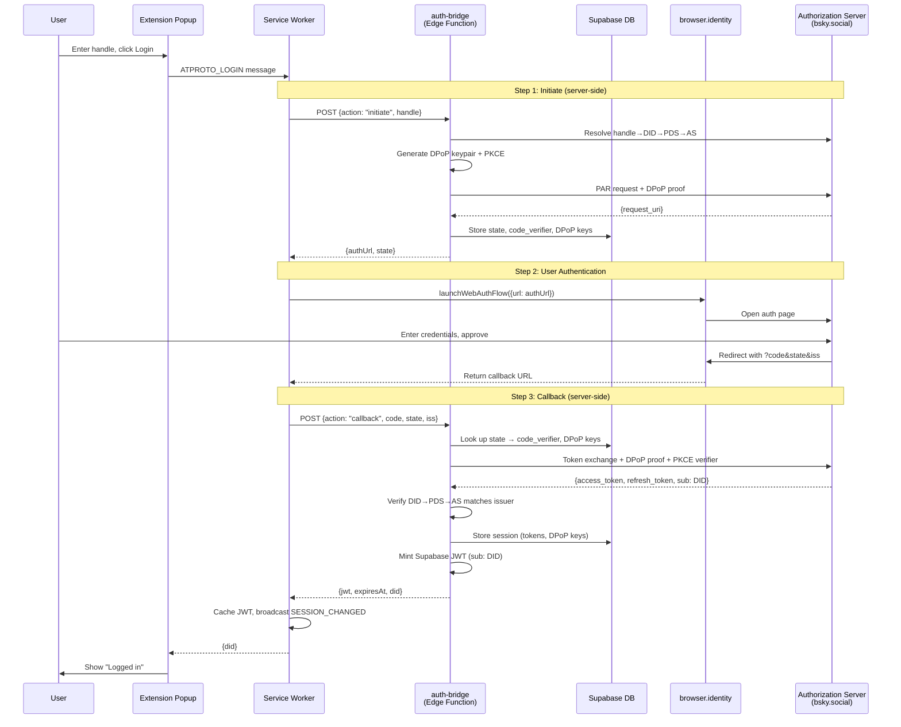

# AT Protocol OAuth + Supabase Auth (BFF)

Mustard authenticates users via Bluesky (AT Protocol) OAuth and mints Supabase
JWTs server-side. Read this before touching `auth-bridge`, `SupabaseAuth`,
`AtprotoAuth`, or anything that handles sessions/JWTs.

## Why BFF (Backend For Frontend) is mandatory

- **ATProto access tokens are opaque**: the JWKS endpoint
  (`bsky.social/oauth/jwks`) returns `{"keys":[]}` — third parties cannot verify
  access-token signatures. This rules out "pass the access token to your backend
  for verification" designs.
- Because tokens can't be independently verified, **the server must be the OAuth
  client**. The `auth-bridge` Edge Function handles PAR, DPoP, PKCE, and token
  exchange; the extension only opens the auth page and forwards the callback.
- **`@atproto/oauth-client-browser` is not needed** with BFF (it's for client-side
  OAuth). The extension just `fetch`es `auth-bridge` and uses
  `browser.identity.launchWebAuthFlow()` for the redirect — no client-side OAuth
  SDK.

## OAuth flow (sequence)

## Key components

- **auth-bridge (BFF)**: server-side OAuth client. Holds DPoP keys + ATProto
  tokens; the extension never sees them. Mints Supabase JWTs only after a verified
  login.
- **client-metadata.json** (GitHub Pages, public HTTPS): the OAuth client config.
  Its URL **is** the `client_id`. `redirect_uris` must include the
  `chromiumapp.org` URL (and the Firefox `allizom.org` URL). Add an empty
  `.nojekyll` so GitHub Pages serves it without a Jekyll build. **Don't host it on
  Supabase**: Storage serves `.html`/files as `text/plain`, and Edge Functions
  intentionally rewrite `text/html` → `text/plain` (APIs only) — use GitHub Pages
  / Cloudflare Pages / similar static hosting.
- **redirect_uri**: Chrome → `chromiumapp.org`; Firefox →
  `https://<sha1(gecko.id)>.extensions.allizom.org/<path>` (see
  `cross-browser-webext` skill for deriving these).
- **PKCE**: prevents auth-code interception. **PAR**: pushes auth params to the AS
  before redirect (required by AT Protocol). **DPoP**: binds tokens to
  server-held keys.
- **Identity verification**: after token exchange, auth-bridge independently
  resolves DID→PDS→AS to confirm the AS is authoritative for that DID — without
  it, a malicious AS could claim to authenticate any DID.

## Gotchas

- **DPoP nonce retry**: the AS rejects the first DPoP-signed request with
  `use_dpop_nonce` and returns the nonce in a header. Standard pattern: send with
  empty nonce, retry with the server-provided nonce.
- **Extension ID stability**: redirect URIs break if the extension ID changes.
  Pin Chrome via `manifest.key` and Firefox via `gecko.id` (see
  `cross-browser-webext` skill).
- **Popup closes during OAuth**: extension popups close when `launchWebAuthFlow`
  opens (loses focus). Run OAuth in the **service worker** (persists) and
  communicate via messaging.

## Supabase JWT lifecycle

- `SupabaseAuth.ts` caches the JWT with a 1h TTL; refresh goes through auth-bridge
  using the expired JWT as proof.
- **Refresh 404 = logout**: auth-bridge deletes the `oauth_session` row when an
  ATProto token refresh fails (e.g. a race consuming a single-use refresh token).
  The extension must treat **404/4xx/502** from refresh as "needs re-login": clear
  both the ATProto session and the Supabase JWT from storage and broadcast
  `SESSION_CHANGED(null)`. **Do NOT clear on 5xx** (transient server errors).
- `SESSION_CHANGED` is broadcast to all tabs on login/logout so content scripts
  re-query notes without a page reload.

## Auth-related tables

- `oauth_login_state`: temporary PAR/PKCE/DPoP state during login (~10 min TTL).
- `oauth_session`: server-side ATProto token storage used for JWT refresh.
