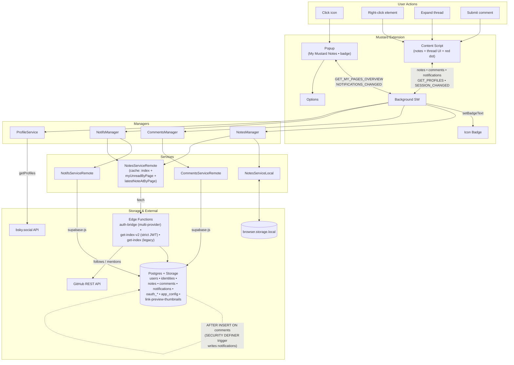

# Mustard Architecture

System map of the Mustard extension. Use this to orient before a change and to
find which layer owns a concern. For auth specifics see `atproto-supabase-auth`;
for cross-browser/WXT specifics see `cross-browser-webext`.

## System diagram

## Layers

- **Runtime surfaces** (`src/entrypoints/`): `popup/`, `options/`, `content/`,
  `background.ts`, plus `url-change-detector.ts` (unlisted script intercepting
  pushState/replaceState for SPA nav). Content script renders notes/threads;
  background owns messaging, auth, and all data operations.
- **Managers** (`src/background/business/`): coordinate services and merge data.
  `NotesManager` is a facade — always queries local, merges remote when logged
  in. Comments/Notifs/Profiles have their own managers.
- **Services** (`src/background/business/`): `NotesServiceLocal`
  (`browser.storage.local`), `NotesServiceRemote` (Supabase + edge functions,
  index cache with 30s TTL), `CommentsServiceRemote`, `NotifsServiceRemote`
  (both via `supabase-js`).
- **Auth** (`src/background/auth/`): `AtprotoAuth`, `SupabaseAuth` — see the
  `atproto-supabase-auth` skill.
- **Shared** (`src/shared/`): `messaging.ts` (type-safe messages), `dto/`
  (serialization across the SW↔CS boundary), `model/` (domain types).
- **Edge functions** (`supabase/functions/`): `auth-bridge` (multi-provider BFF
  OAuth + JWT mint + identity linking — see `atproto-supabase-auth`),
  `get-index-v2` (strict per-user JWT verified with `jose`, enforces
  `payload.sub === userId` where userId is the account UUID), `get-index`
  (legacy anon-key, kept for old clients until the version guard retires them).

## Conventions worth knowing

- **DTO boundary**: messaging uses DTOs; the content script converts to domain
  models for Vue. Strip Vue reactivity before `sendMessage`
  (see `cross-browser-webext`).
- **Re-query pattern for mutations**: after upsert/delete/repost/comment, the
  remote index cache is invalidated and notes are re-queried rather than mutated
  in place.
- **Positioning**: notes use fixed positioning + scroll listeners so anchoring
  never affects page layout or creates scrollbars; recalculated on resize.
  Anchor resolution: `elementId` → `elementSelector` → `clickPosition` fallback.
- **Reposts are visibility grants**, not new notes: resolved alongside (not merged
  into) the author index to avoid leaking the author's other notes.
- **Notifications**: presence-of-row = unread (no `read` column); a
  `SECURITY DEFINER` trigger on `comments` INSERT writes them and skips
  self-comments.
- **Identity = opaque UUID, not provider id**: authors/reposters/mention actors
  are `users.id` UUIDs. To render them, `GET_PROFILES` and mention enrichment go
  through `resolveProfilesByUserId` (UUID → `identities` → atproto Bluesky
  profile, else a github profile from the login). Never feed a UUID straight to
  the DID-based Bluesky lookup.
- **Multi-provider follow graph**: `get-index-v2` resolves the viewer's atproto
  follows **and** github follows to Mustard userIds. Each provider's follow fetch
  degrades independently — a dead github token returns `[]` instead of failing
  the whole index (so notes from other providers still load).
- **Multi-provider mentions** (Option A): only people who are Mustard users are
  mentionable. atproto candidates come from mutuals; github candidates are your
  github follows who signed up (`github-mention-candidates`). Mentions store a
  `provider_account_id`; rendering resolves them via the identities table.
- **Client version guard**: `app_config.min_client_version` is read (cached,
  fail-open) by `AppStatusService`; `isRemoteMutationMessage` gates remote writes
  in the background dispatcher and the content-script chokepoint so an outdated
  client goes read-only and prompts to update. See `cross-browser-webext` for the
  update/auto-update mechanics.
