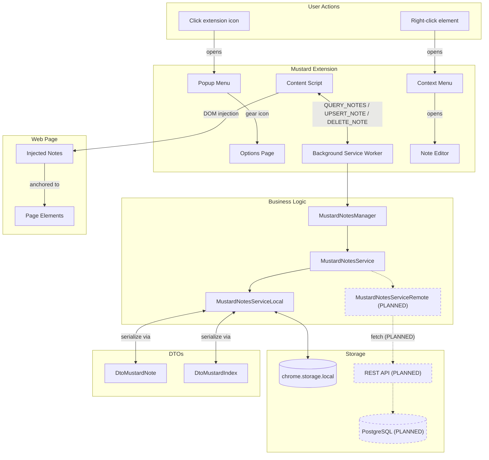

# Development Progress

This document tracks the current implementation status of Mustard features. Compare against `README.md` to see what's completed vs. what's still needed.

## Architecture

## Completed

- Chrome extension setup with CRXJS and HMR working
- Extension icon (mustard bottle) displays in Chrome toolbar
- MustardPopupMenu accessible via extension icon click
- MustardOptionsPage accessible via chrome://extensions → Options
- Background service worker initialized
- Content script initialized (runs on all URLs)
- Context menu "Add Mustard" appears on right-click, handled in service worker
- Gear icon in popup menu opens options page
- Tailwind v4 configured via `@tailwindcss/vite`, imported in popup & options entry points
- Editor positioned at click location using anchor data (elementId → elementSelector → clickPosition fallback)
- Anchor data captured: pageUrl, elementId, elementSelector, relativePosition, clickPosition
- Type-safe messaging in `src/shared/messaging.ts`
- Reactive mustardState shared via provide/inject
- Positioning logic centralized in MustardContent, child components stay dumb
- UI folder reorganized: content script components in `src/ui/content/`
- Modular content styles in `content-styles.css` (mustard-plastic, mustard-rounded, mustard-text-\*, mustard-padding)
- Note Editor styled with mustard bottle aesthetic
- `MustardNotesService` interface: `queryIndex(userId)`, `queryNotes(pageUrl, userId)`, `upsertNote`, `deleteNote`
- `MustardNotesServiceLocal` implementation using chrome.storage.local
- DTOs for serialization: `DtoMustardNote`, `DtoMustardIndex` with `toDto`/`fromDto` mappers
- `MustardNote` model with `authorId`, `MustardIndex` class with follows/merge support
- `MustardNotesManager` coordinates services, merges indexes from multiple services
- Service worker ↔ content script: `QUERY_NOTES`, `UPSERT_NOTE`, `DELETE_NOTE` messaging via sendResponse
- Notes persisted to chrome.storage.local and retrieved on page load
- DTOs moved to `src/shared/dto/` for access by both background and content scripts
- `MustardNote.vue` component renders notes at anchor positions with date footer
- Notes injected into pages via MustardContent, positioned using anchor data
- Delete note: trash icon removes note, re-queries fresh list (re-query pattern for mutations)
- Clean DTO boundary: messaging uses DTOs, content-script converts to domain models for Vue
- Note positions recalculate on window resize
