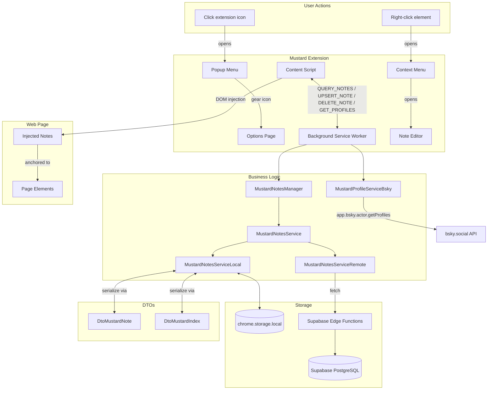
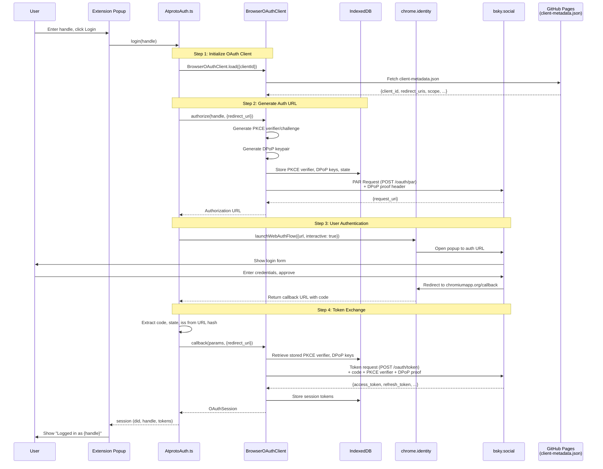

# Development Progress

This document tracks the current implementation status of Mustard features. Compare against `README.md` to see what's completed vs. what's still needed.

## Architecture

## Completed

- Chrome extension setup with CRXJS and HMR working
- Extension icon (mustard bottle) displays in Chrome toolbar
- MustardPopupMenu accessible via extension icon click
- MustardOptionsPage accessible via chrome://extensions → Options
- Background service worker initialized
- Content script initialized (runs on all URLs)
- Context menu "Add Mustard" appears on right-click, handled in service worker
- Gear icon in popup menu opens options page
- Tailwind v4 configured via `@tailwindcss/vite`, imported in popup & options entry points
- Editor positioned at click location using anchor data (elementId → elementSelector → clickPosition fallback)
- Anchor data captured: pageUrl, elementId, elementSelector, relativePosition, clickPosition
- Type-safe messaging in `src/shared/messaging.ts`
- Reactive mustardState shared via provide/inject
- Positioning logic centralized in MustardContent, child components stay dumb
- UI folder reorganized: content script components in `src/ui/content/`
- Modular content styles in `content-styles.css` (mustard-plastic, mustard-rounded, mustard-text-\*, mustard-padding)
- Note Editor styled with mustard bottle aesthetic
- `MustardNotesService` interface: `queryIndex(userId)`, `queryNotes(pageUrl, userId)`, `upsertNote`, `deleteNote`
- `MustardNotesServiceLocal` implementation using chrome.storage.local
- DTOs for serialization: `DtoMustardNote`, `DtoMustardIndex` with `toDto`/`fromDto` mappers
- `MustardNote` model with `authorId`, `MustardIndex` class with follows/merge support
- `MustardNotesManager` coordinates services, merges indexes from multiple services
- Service worker ↔ content script: `QUERY_NOTES`, `UPSERT_NOTE`, `DELETE_NOTE` messaging via sendResponse
- Notes persisted to chrome.storage.local and retrieved on page load
- DTOs moved to `src/shared/dto/` for access by both background and content scripts
- `MustardNote.vue` component renders notes at anchor positions with date footer
- Notes injected into pages via MustardContent, positioned using anchor data
- Delete note: trash icon removes note, re-queries fresh list (re-query pattern for mutations)
- Clean DTO boundary: messaging uses DTOs, content-script converts to domain models for Vue
- Note positions recalculate on window resize
- AT Protocol OAuth login via Bluesky working (popup → auth → session)
- `MustardProfileService` interface + `MustardProfileServiceBsky` implementation using `@atproto/api`
- `UserProfile` model with type discriminator, `BskyProfile` satisfies it
- Popup displays user avatar, display name, and @handle when logged in
- Profile fetching via service worker `GET_PROFILES` message (bulk fetch using `app.bsky.actor.getProfiles`)
- Notes auto-select `authorId` based on session (DID if logged in, `'local'` otherwise)
- Service routing stubbed: `upsertNote(note, 'local' | 'remote')` with fallback to local until remote implemented
- `MustardNotesManager` acts as facade: always queries local, merges remote when logged in (remote stubbed)
- `currentUserDid` in content script state for note ownership checks (`authorId === 'local' || authorId === currentUserDid`)
- Note icons: publish arrow for local notes, cloud checkmark for remote notes (edit icon removed)
- Editor has Save (local) and Publish (remote) buttons; publish opens login popup if not authenticated
- `MustardNotesServiceRemote` implementation using Supabase client + Edge Functions
- Supabase Edge Functions: `auth-bridge` (mints JWTs from DIDs), `get-index` (fetches follows + notes index)
- `SupabaseAuth.ts`: JWT caching with 55min TTL, automatic refresh
- Remote index caching with 30s TTL, invalidated on login/logout/mutations
- Session broadcast: `SESSION_CHANGED` message to all tabs on login/logout
- Content scripts re-query notes when session changes (no page reload needed)
- SPA navigation detection via injected `url-change-detector.js` (intercepts pushState/replaceState)
- Notes cleared and re-queried when URL changes (works on Bluesky and other SPAs)
- `pendingNoteIds` state disables action buttons while syncing
- Published icon rendered as static (non-interactive) indicator
- Publish flow: local note kept visible until remote publish confirmed, then deleted

## AT Protocol OAuth Flow

### Key Components

- **client-metadata.json** (GitHub Pages): Public OAuth client configuration. The URL to this file IS the `client_id`
- **redirect_uri** (`chromiumapp.org`): Chrome extension's special OAuth callback URL - Chrome intercepts redirects here
- **PKCE**: Proof Key for Code Exchange - prevents authorization code interception
- **DPoP**: Demonstrating Proof of Possession - binds tokens to cryptographic keys
- **PAR**: Pushed Authorization Request - sends auth params to server before redirect (required by AT Protocol)
