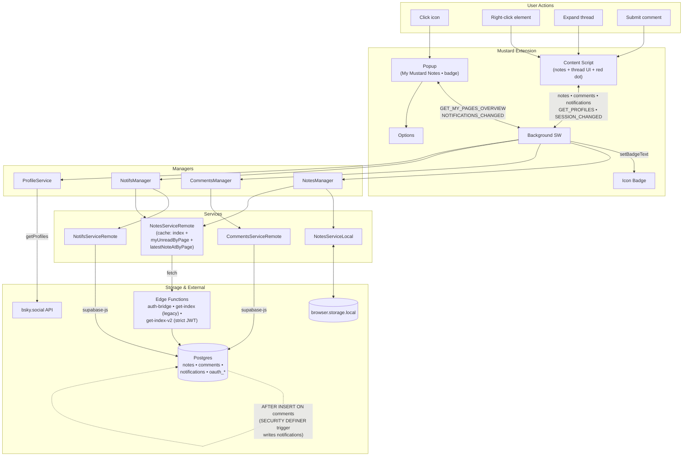
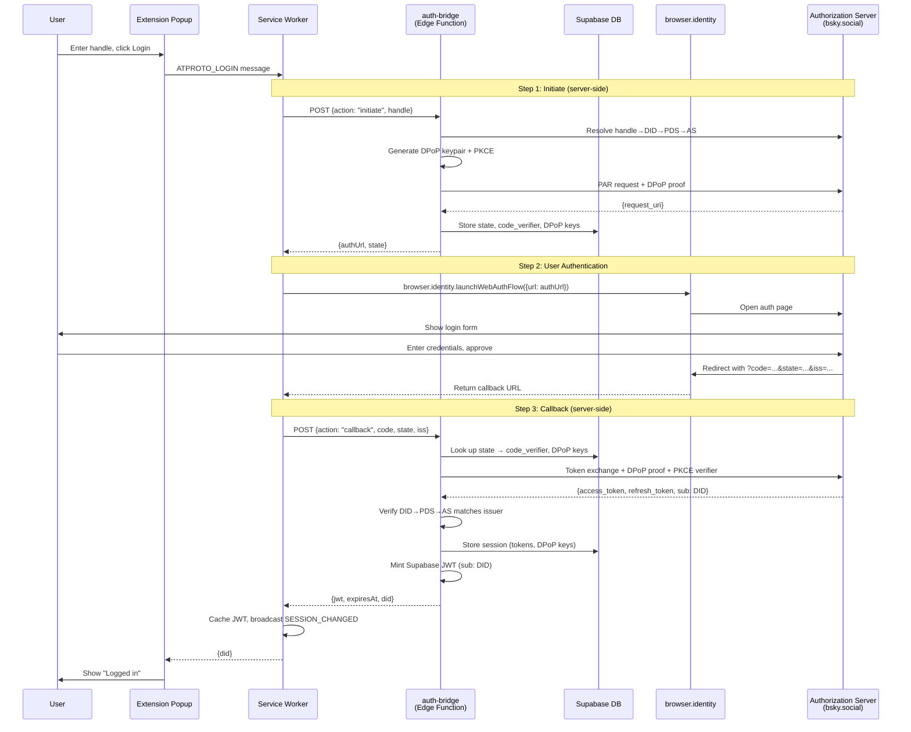

# Development Progress

This document tracks the current implementation status of Mustard features. Compare against `README.md` to see what's completed vs. what's still needed.

## Architecture

```mermaid
flowchart TB
    subgraph User["User Actions"]
        direction LR
        Click["Click icon"]
        RightClick["Right-click element"]
        Expand["Expand thread"]
        Comment["Submit comment"]
    end

    subgraph Extension["Mustard Extension"]
        direction LR
        Popup["Popup<br/>(My Mustard Notes • badge)"]
        Options["Options"]
        CS["Content Script<br/>(notes + thread UI + red dot)"]
        Badge["Icon Badge"]
        BG["Background SW"]
    end

    subgraph Managers["Managers"]
        direction LR
        NotesManager["NotesManager"]
        CommentsManager["CommentsManager"]
        NotifsManager["NotifsManager"]
        ProfileService["ProfileService"]
    end

    subgraph Svcs["Services"]
        direction LR
        LocalSvc["NotesServiceLocal"]
        RemoteSvc["NotesServiceRemote<br/>(cache: index +<br/>myUnreadByPage +<br/>latestNoteAtByPage)"]
        CommentsSvc["CommentsServiceRemote"]
        NotifsSvc["NotifsServiceRemote"]
    end

    subgraph Storage["Storage & External"]
        direction LR
        ChromeStorage[("browser.storage.local")]
        EdgeFns["Edge Functions<br/>auth-bridge • get-index (legacy) •<br/>get-index-v2 (strict JWT)"]
        DB[("Postgres<br/>notes • comments •<br/>notifications • oauth_*")]
        BSkyAPI["bsky.social API"]
    end

    %% Layer flow
    Click --> Popup
    RightClick --> CS
    Expand --> CS
    Comment --> CS

    Popup <-->|"GET_MY_PAGES_OVERVIEW<br/>NOTIFICATIONS_CHANGED"| BG
    Popup --> Options
    CS <-->|"notes • comments • notifications<br/>GET_PROFILES • SESSION_CHANGED"| BG
    BG -->|"setBadgeText"| Badge

    BG --> NotesManager
    BG --> CommentsManager
    BG --> NotifsManager
    BG --> ProfileService

    NotesManager --> LocalSvc
    NotesManager --> RemoteSvc
    CommentsManager --> CommentsSvc
    NotifsManager --> NotifsSvc
    NotifsManager --> RemoteSvc

    LocalSvc <--> ChromeStorage
    RemoteSvc -->|"fetch"| EdgeFns
    CommentsSvc -->|"supabase-js"| DB
    NotifsSvc -->|"supabase-js"| DB
    EdgeFns --> DB
    ProfileService -->|"getProfiles"| BSkyAPI

    DB -.->|"AFTER INSERT ON comments<br/>(SECURITY DEFINER trigger<br/>writes notifications)"| DB
```

## Completed

- Chrome + Firefox extension setup with WXT (cross-browser framework, Vite-based); Tailwind CSS removed; all `chrome.*` APIs replaced with `browser.*`
- Per-browser build output: `./dist/chrome` and `./dist/firefox` via `outDirTemplate: '{{browser}}'`
- Chrome local unpacked ID pinned to Web Store ID (`mmdodhbelecgangbkloiaoohdinhkpcj`) via `manifest.key` — dev and prod share one OAuth redirect URI
- Firefox addon ID pinned via `browser_specific_settings.gecko.id: 'mustard@notes'` — stable redirect URI across reloads and future AMO submission
- npm scripts: `dev`/`dev:firefox` build against production supabase; `dev:local`/`dev:firefox:local` against local supabase
- Extension icon (mustard bottle) displays in Chrome toolbar
- MustardPopupMenu accessible via extension icon click
- MustardOptionsPage accessible via chrome://extensions → Options
- Background service worker initialized
- Content script initialized (runs on all URLs)
- Context menu "Add Mustard" appears on right-click, handled in service worker
- Gear icon in popup menu opens options page
- Editor positioned at click location using anchor data (elementId → elementSelector → clickPosition fallback)
- Anchor data captured: pageUrl, elementId, elementSelector, relativePosition, clickPosition
- Type-safe messaging in `src/shared/messaging.ts`
- Reactive mustardState shared via provide/inject
- Positioning logic centralized in MustardContent, child components stay dumb
- UI folder reorganized: content script components in `src/ui/content/`
- Modular content styles in `content-styles.css` (mustard-plastic, mustard-rounded, mustard-text-\*, mustard-padding)
- Note Editor styled with mustard bottle aesthetic
- `MustardNotesService` interface: `queryIndex(userId)`, `queryNotes(pageUrl, userId)`, `upsertNote`, `deleteNote`
- `MustardNotesServiceLocal` implementation using chrome.storage.local
- DTOs for serialization: `DtoMustardNote`, `DtoMustardIndex` with `toDto`/`fromDto` mappers
- `MustardNote` model with `authorId`, `MustardIndex` class with follows/merge support
- `MustardNotesManager` coordinates services, merges indexes from multiple services
- Service worker ↔ content script messaging via Promise-returning `onMessage` listeners (cross-browser: Chrome 99+ and Firefox); relay strips Vue reactive Proxies via `JSON.parse(JSON.stringify(...))` before `runtime.sendMessage` (Firefox `structuredClone` rejects proxies)
- Notes persisted to chrome.storage.local and retrieved on page load
- DTOs moved to `src/shared/dto/` for access by both background and content scripts
- `MustardNote.vue` component renders notes at anchor positions with date footer
- Notes injected into pages via MustardContent, positioned using anchor data
- Delete note: trash icon removes note, re-queries fresh list (re-query pattern for mutations)
- Clean DTO boundary: messaging uses DTOs, content-script converts to domain models for Vue
- Note positions recalculate on window resize
- AT Protocol OAuth login via Bluesky working (popup → auth → session)
- `MustardProfileService` interface + `MustardProfileServiceBsky` implementation using `@atproto/api`
- `UserProfile` model with type discriminator, `BskyProfile` satisfies it
- Popup displays user avatar, display name, and @handle when logged in
- Profile fetching via service worker `GET_PROFILES` message (bulk fetch using `app.bsky.actor.getProfiles`)
- Notes auto-select `authorId` based on session (DID if logged in, `'local'` otherwise)
- Service routing stubbed: `upsertNote(note, 'local' | 'remote')` with fallback to local until remote implemented
- `MustardNotesManager` acts as facade: always queries local, merges remote when logged in (remote stubbed)
- `currentUserDid` in content script state for note ownership checks (`authorId === 'local' || authorId === currentUserDid`)
- Note icons: publish arrow for local notes, cloud checkmark for remote notes (edit icon removed)
- Editor has Save (local) and Publish (remote) buttons; publish opens login popup if not authenticated
- `MustardNotesServiceRemote` implementation using Supabase client + Edge Functions
- Supabase Edge Functions: `auth-bridge` (BFF OAuth + JWT minting), `get-index` (fetches follows + notes index)
- Auth-bridge BFF pattern: server-side ATProto OAuth (handle→DID→PDS→AS resolution, DPoP key management, PKCE, PAR, token exchange, identity verification) — Supabase JWTs only minted after verified login
- `oauth_login_state` table: temporary PAR/PKCE/DPoP state during login (~10 min TTL)
- `oauth_session` table: server-side ATProto token storage for JWT refresh
- `SupabaseAuth.ts`: JWT caching with 1h TTL, refresh via auth-bridge using expired JWT as proof
- Remote index caching with 30s TTL, invalidated on login/logout/mutations
- Session broadcast: `SESSION_CHANGED` message to all tabs on login/logout
- Content scripts re-query notes when session changes (no page reload needed)
- SPA navigation detection via injected `url-change-detector.js` (intercepts pushState/replaceState)
- Notes cleared and re-queried when URL changes (works on Bluesky and other SPAs)
- `pendingNoteIds` state disables action buttons while syncing
- Published icon rendered as static (non-interactive) indicator
- Publish flow: local note kept visible until remote publish confirmed, then deleted
- Notes draggable: click and drag anywhere on note to reposition (temporary, not persisted)
- Remote notes display author avatar (clickable link to their Bluesky profile)
- Rich content in notes: URLs auto-detected and rendered as inline images (png/jpg/jpeg/gif/webp) or clickable links
- Images constrained to note width (260px max), non-draggable, don't interfere with note dragging
- CSP configured to allow loading images from HTTPS sources
- Security limits enforced: content (300 chars), selectors (500 chars), page URLs (2000 chars)
- Multi-layer validation: client-side (selector generation), UI (disabled buttons), service layer, database constraints
- Character counter in editor (subtle date-style display, turns red when over limit)
- Oversized local notes show character count and disable publish button (local saves unrestricted)
- Selector length validation returns `null` for fallback to click position
- Database migration files: 001 (table structure), 002 (CHECK constraints), 003 (OAuth tables)
- Notes use fixed positioning + scroll listeners: anchor to elements without affecting page layout or causing scrollbars
- Comments: flat (no nesting) comment threads on remote notes only; `comments` table (public read, author-only write/delete, 300-char limit, cascades from `notes`); bottom-left `CommentToggle` pill with speech-bubble icon, unread red dot, count, and hover-only "+ Add comment" affordance (CSS-only `grid-template-columns: 0fr→1fr` animation); thread expands downward with `max-height: 240px` scroll, auto-scrolls to newest on open; comments load in parallel with notes (notes paint first); comment authors' avatars fetched via existing `GET_PROFILES`; current user's avatar shown next to input
- Notifications: `notifications` table (presence = unread, no read column, cascades from `notes` and `comments`); Postgres `SECURITY DEFINER` trigger on `comments` INSERT skips self-comments; extension-icon badge via cross-browser `getActionApi()` shim (`browser.action` MV3 / `browser.browserAction` MV2 fallback); "My Mustard Notes" collapsible section in popup lists pages with notes sorted by unread-count desc then most-recent-note desc; in-page red dot clears when thread expanded (`MARK_NOTIFICATIONS_SEEN_FOR_NOTE` deletes rows)
- `get-index` edge function preserved as legacy (anon-key auth, original `{ index }` response) so currently-deployed clients keep working; new strict-auth variant lives at `get-index-v2` (per-user Supabase JWT verified via `jose.jwtVerify` against `JWT_SIGNING_SECRET`, enforces `payload.sub === did`, additionally returns `myUnreadByPage` + `latestNoteAtByPage` for the popup overview). New client points at `get-index-v2`; v1 can be removed once CWS auto-update has fully propagated
- Note rendering: `white-space: pre-wrap` removed from `.mustard-note-content` (was causing markdown-it's inter-tag `\n` to render as visible blank lines)
- Note rendering: empty/whitespace-only `
` tags stripped from markdown-it output via `EMPTY_P_REGEX` (CSS `p:empty` missed `
\n
`)
- Note content trimmed before render and before save to prevent trailing newlines creating phantom ` ` elements
- `knip` added as devDep with `knip.json` config; `nr knip` / `nr knip:fix` scripts available for dead code detection
- Context invalidation detection: app unmounts and shows refresh banner when extension is reloaded while a tab is open
- Content script icons inlined as base64 data URIs via `inlineIcons` Vite plugin (bypasses host page `img-src` CSP in both dev and prod)
- Minimize notes: global preference (popup toggle + options checkbox), persisted via `chrome.storage.local`; notes collapse to small pills showing avatar/gradient corner, expand on hover with staggered width→height animation
- Show anchor in editor: options page checkbox (default off), controls whether anchor data (URL + selector) is displayed in the note editor
- Options page preferences synced to content scripts via `chrome.storage.onChanged` (same pattern as publish warning)

## AT Protocol OAuth Flow (BFF Pattern)

```mermaid
sequenceDiagram
    participant User
    participant Popup as Extension Popup
    participant SW as Service Worker
    participant Bridge as auth-bridge<br/>(Edge Function)
    participant DB as Supabase DB
    participant Chrome as browser.identity
    participant AS as Authorization Server<br/>(bsky.social)

    User->>Popup: Enter handle, click Login
    Popup->>SW: ATPROTO_LOGIN message

    Note over SW,AS: Step 1: Initiate (server-side)
    SW->>Bridge: POST {action: "initiate", handle}
    Bridge->>AS: Resolve handle→DID→PDS→AS
    Bridge->>Bridge: Generate DPoP keypair + PKCE
    Bridge->>AS: PAR request + DPoP proof
    AS-->>Bridge: {request_uri}
    Bridge->>DB: Store state, code_verifier, DPoP keys
    Bridge-->>SW: {authUrl, state}

    Note over SW,AS: Step 2: User Authentication
    SW->>Chrome: browser.identity.launchWebAuthFlow({url: authUrl})
    Chrome->>AS: Open auth page
    AS->>User: Show login form
    User->>AS: Enter credentials, approve
    AS->>Chrome: Redirect with ?code=...&state=...&iss=...
    Chrome-->>SW: Return callback URL

    Note over SW,AS: Step 3: Callback (server-side)
    SW->>Bridge: POST {action: "callback", code, state, iss}
    Bridge->>DB: Look up state → code_verifier, DPoP keys
    Bridge->>AS: Token exchange + DPoP proof + PKCE verifier
    AS-->>Bridge: {access_token, refresh_token, sub: DID}
    Bridge->>Bridge: Verify DID→PDS→AS matches issuer
    Bridge->>DB: Store session (tokens, DPoP keys)
    Bridge->>Bridge: Mint Supabase JWT (sub: DID)
    Bridge-->>SW: {jwt, expiresAt, did}

    SW->>SW: Cache JWT, broadcast SESSION_CHANGED
    SW-->>Popup: {did}
    Popup->>User: Show "Logged in"
```

### Key Components

- **auth-bridge (BFF)**: Server-side OAuth client — holds DPoP keys and ATProto tokens, extension never sees them
- **client-metadata.json** (GitHub Pages): Public OAuth client configuration. The URL to this file IS the `client_id`
- **redirect_uri** (`chromiumapp.org`): Chrome extension's special OAuth callback URL — Chrome intercepts redirects here
- **PKCE** (Proof Key for Code Exchange): Prevents authorization code interception
- **DPoP** (Demonstrating Proof of Possession): Binds tokens to server-held cryptographic keys
- **PAR** (Pushed Authorization Request): Sends auth params to server before redirect (required by AT Protocol)
- **Identity verification**: After token exchange, auth-bridge independently resolves DID→PDS→AS to confirm the AS is authoritative
- Supabase JWT refresh failure (404 = server session gone) clears both ATProto + Supabase sessions and broadcasts `SESSION_CHANGED(null)` to all tabs — user is immediately logged out instead of silently failing
