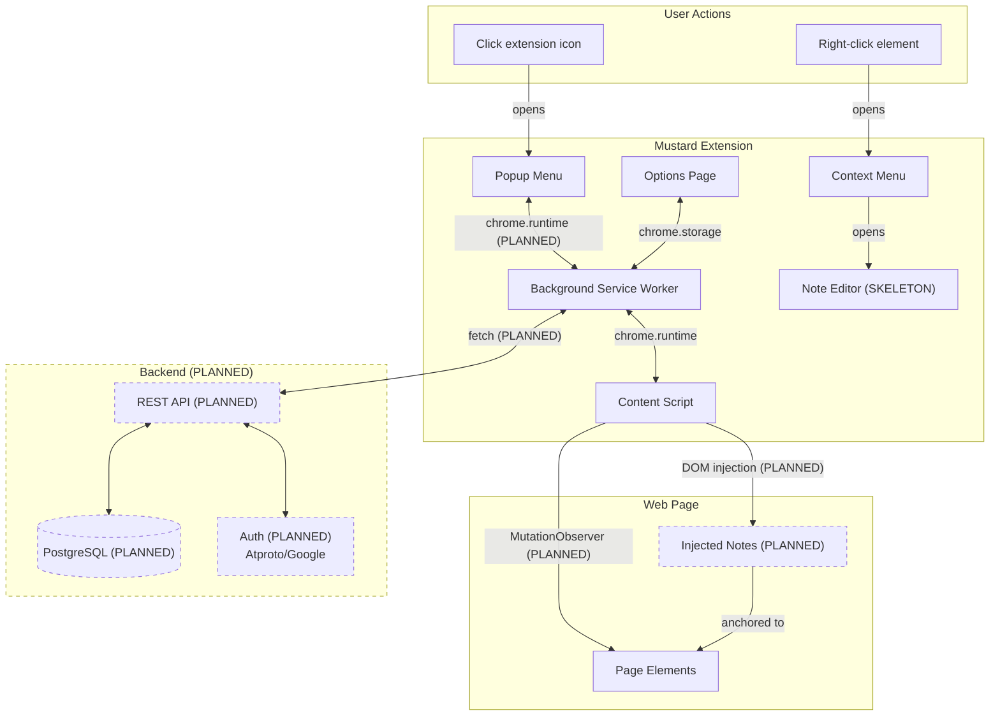

# Development Progress

This document tracks the current implementation status of Mustard features. Compare against `README.md` to see what's completed vs. what's still needed.

## Architecture

## Completed

- Chrome extension setup with CRXJS and HMR working
- Extension icon (mustard bottle) displays in Chrome toolbar
- MustardPopupMenu accessible via extension icon click
- MustardOptionsPage accessible via chrome://extensions → Options
- Background service worker initialized
- Content script initialized (runs on all URLs)
- Context menu "Add Mustard" appears on right-click, handled in service worker
- Gear icon in popup menu opens options page
- Tailwind v4 configured via `@tailwindcss/vite`, imported in popup & options entry points
- Editor positioned at click location using anchor data (elementId → elementSelector → clickPosition fallback)
- Anchor data captured: pageUrl, elementId, elementSelector, relativePosition, clickPosition
- Type-safe messaging in `src/shared/messaging.ts`
- Reactive mustardState shared via provide/inject
- Positioning logic centralized in MustardContent, child components stay dumb
