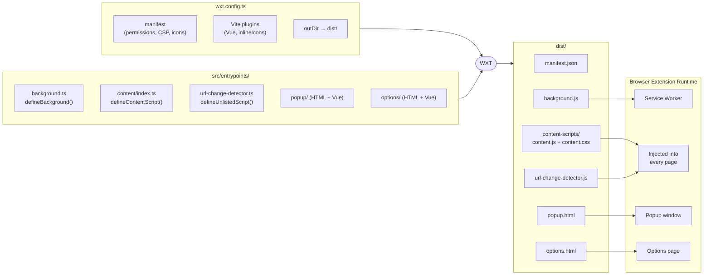

# Mustard

A browser extension that lets users annotate web pages with "mustard" (notes) and follow others to see their annotations on the same pages.

## Project Vision

### The Concept

The name "mustard" comes from the German saying _"seinen Senf dazu geben"_ (to add one's opinion to something). This extension enables users to add their "mustard" (opinions/notes) to any webpage.

### Core Features

#### Note Creation & Management

- Users can annotate any part of any webpage with notes
- Notes can contain text (up to 300 characters), images planned for future
- **Creation workflow**: Right-click on any element → "Add Mustard" → Note editor opens
- **Two save modes**:
  - **Save locally**: Stored in browser only (no login required)
  - **Publish**: Stored on server, visible to followers (requires login — Bluesky or GitHub)
- Users can delete their own notes
- **Comments**: Any logged-in user can leave flat (non-nested) comments on published notes; comments are publicly readable; note authors are notified of new comments via an extension-icon badge and a "My Mustard Notes" popup section; unread indicators clear when the comment thread is expanded

#### Accounts & Social Graph

- **Multi-provider accounts**: a Mustard account is a stable, opaque UUID that can
  link **multiple provider identities** (Bluesky/AT Protocol and GitHub). Link or
  unlink providers from the options page; unlinking the last identity deletes the
  account and all its content.
- Uses each linked provider's **follow graph** — people you follow on Bluesky
  _or_ GitHub can see your published mustard (per-provider follow resolution
  degrades independently, so one dead token never hides everything).
- **Mentions** (`@`): only people who are Mustard users are mentionable — Bluesky
  mutuals and GitHub follows who have signed up.
- When visiting a page where a followed user has added mustard, those notes appear
  at the anchored locations; multiple follows' notes can appear simultaneously.
- **Authentication**: OAuth via Bluesky (AT Protocol) and GitHub.

#### Page Identification & Note Positioning

- **Page matching**: URLs normalized without query parameters
- **Element anchoring**:
  - Primary: CSS selector (generated from element hierarchy)
  - Fallback: Absolute click position (viewport % + scroll offset)
- **SPA support**: Detects client-side navigation (pushState/replaceState) and re-queries notes

## Technical Architecture

### WXT Build Pipeline



### Frontend (Browser Extension)

- **Content Script**: Injects mustard notes into web pages, handles SPA navigation
- **Background Service Worker**: Manages messaging, authentication, note operations
- **Popup**: Login/logout, user profile display
- **Options Page**: Settings (placeholder)

### Backend (Supabase)

- **PostgreSQL Database**: `users` + `identities` (the UUID account model),
  published `notes`/`comments`/`notifications`, and `oauth_*` auth state — all
  protected by RLS policies
- **Storage**: globally content-addressed, bounded link-preview thumbnails;
  identical WebP bytes are shared across every author's published notes
- **Edge Functions**:
  - `auth-bridge`: multi-provider BFF OAuth (Bluesky + GitHub), mints Supabase
    JWTs and links/unlinks provider identities to a Mustard account UUID
  - `get-index-v2`: strict per-user JWT (verified with `jose`), resolves the
    viewer's Bluesky **and** GitHub follows to Mustard userIds and returns their
    notes index
  - `link-preview-thumbnail`: verifies an owned note reference and the WebP's
    SHA-256 before privileged global Storage uploads and reference-safe cleanup
  - `get-index`: legacy anon-key version, kept until the version guard retires
    old clients
- **Authentication**: custom JWT strategy where the subject is an **opaque
  account UUID** (`users.id`); provider-specific ids live only in `identities`

### Data Flow

1. User logs in via Bluesky or GitHub OAuth → `auth-bridge` upserts an identity,
   resolves it to a Mustard account UUID, and mints a Supabase JWT (`sub = UUID`)
2. User navigates to page → Extension calls `get-index-v2` with the UUID + JWT
3. `get-index-v2` looks up the user's linked identities, fetches their Bluesky +
   GitHub follows, maps those follows back to Mustard userIds via `identities`,
   and queries the DB for notes from those users
4. Extension fetches specific notes for the current page URL
5. Notes injected into page at anchored positions

## Technical Stack

- **Vue 3** - Frontend framework
- **TypeScript** - Type safety
- **WXT** - Cross-browser extension framework (Vite-based, replaces `@crxjs/vite-plugin`)
- **Supabase** - PostgreSQL database + Edge Functions
- **AT Protocol (Bluesky)** + **GitHub** - multi-provider authentication and social graph

## Development

### Prerequisites

- Node.js 20.19+ or 22.12+
- Docker (for local Supabase)
- Supabase CLI (`brew install supabase/tap/supabase`)

### Environment Variables

The extension reads two env vars at build time via Vite:

| Variable                 | Description                                                           |
| ------------------------ | --------------------------------------------------------------------- |
| `VITE_SUPABASE_URL`      | Full Supabase project URL                                             |
| `VITE_SUPABASE_ANON_KEY` | Supabase anon/public key (safe to commit — RLS policies protect data) |

WXT/Vite automatically picks the right file based on the command:

| File               | Used by                                                     |
| ------------------ | ----------------------------------------------------------- |
| `.env.development` | `nr dev:local` — points to local Supabase instance          |
| `.env.production`  | `nr dev` and `nr build` — points to hosted Supabase project |

### Setup

```sh
npm install
```

### Local Supabase

To run the full backend locally (PostgreSQL + Edge Functions):

`supabase functions serve` reads `supabase/functions/.env` automatically (it has no effect on deployed functions). That file is **gitignored** because it holds real GitHub OAuth client secrets — copy the committed template and fill in the GitHub values:

```sh
cp supabase/functions/.env.example supabase/functions/.env
```

The template ships with the fixed well-known local `JWT_SIGNING_SECRET` (the default for every local Supabase instance — not sensitive); only the GitHub fields need real values, and only if you're testing GitHub connect locally.

```sh
# Start Docker first, then:
supabase start

# Serve edge functions with hot-reload:
supabase functions serve
```

Migrations in `supabase/migrations/` are applied automatically on `supabase start` — but **only on a fresh database**. Subsequent boots against an existing volume skip new migration files; run `supabase migration up` (preserves data) or `supabase db reset` (replays all migrations from scratch) to apply new ones. Run `supabase status` to verify the local anon key matches `.env.development`.

To stop the local stack:

```sh
supabase stop
```

### Run Development Server

```sh
nr dev          # → hosted Supabase (no local stack needed)
nr dev:local    # → local Supabase (requires supabase start + Docker)
```

WXT watches for file changes and rebuilds automatically. The extension is built to `dist/`.

### Load Extension in Chrome

1. Open `chrome://extensions/`
2. Enable "Developer mode" (top right)
3. Click "Load unpacked"
4. Select the `dist/` folder
5. The extension icon (mustard bottle) appears in toolbar

For manifest changes, click the refresh icon on the extension card in `chrome://extensions/`.

### Load Extension in Firefox

1. Open `about:debugging#/runtime/this-firefox`
2. Click "Load Temporary Add-on..."
3. Select `dist/firefox/manifest.json`
4. The extension icon (mustard bottle) appears in toolbar

### Type Check

```sh
nr type-check
```

### Lint

```sh
nr lint
```

### Build for Production

```sh
nr build        # Chrome (MV3)
nr build:firefox
```

## Supabase Deployment

### Deploy Edge Functions

The Supabase CLI is required. Install it globally or use npx:

```sh
# Install Supabase CLI (if not installed)
npm install -g supabase

# Login to Supabase
supabase login

# Link to your project (run from project root)
supabase link --project-ref YOUR_PROJECT_REF

# Deploy Edge Functions
supabase functions deploy auth-bridge
supabase functions deploy get-index-v2
supabase functions deploy get-index   # legacy, until old clients are retired
```

`auth-bridge` also needs the GitHub OAuth secrets set in the cloud (one app per
browser, due to the single redirect URI per OAuth app):

```sh
supabase secrets set GITHUB_CLIENT_ID=... GITHUB_CLIENT_SECRET=... \
  GITHUB_CLIENT_ID_FIREFOX=... GITHUB_CLIENT_SECRET_FIREFOX=...
```

### Set Edge Function Secrets

The `auth-bridge` function needs the JWT signing secret:

```sh
supabase secrets set JWT_SIGNING_SECRET=your-jwt-secret-from-supabase-dashboard
```

Find your JWT secret in Supabase Dashboard → Settings → API → JWT Settings → JWT Secret.

### Database Migration

Apply the notes table schema:

```sh
supabase db push
```

Or run the SQL manually from `supabase/migrations/001_create_notes.sql`.

See [SUPABASE_SETUP.md](./SUPABASE_SETUP.md) for detailed setup instructions.

## Project Structure

```
src/
├── entrypoints/          # WXT entrypoints (auto-discovered)
│   ├── background.ts     # Background service worker (defineBackground)
│   ├── content/          # Content script (defineContentScript)
│   ├── url-change-detector.ts  # Injected SPA nav script (defineUnlistedScript)
│   ├── popup/            # Extension popup HTML + Vue mount
│   └── options/          # Options page HTML + Vue mount
├── background/           # Business logic (imported by background entrypoint)
│   ├── auth/             # AtprotoAuth, GithubAuth, SupabaseAuth, AuthBridge
│   └── business/         # MustardNotesManager, services
├── shared/               # Shared types, DTOs, models
│   ├── dto/
│   ├── model/
│   └── messaging.ts
├── ui/                   # Vue components
│   ├── content/          # Note rendering (MustardNote, MustardContent)
│   ├── popup/            # MustardPopupMenu, BlueskyLogin
│   └── options/          # MustardOptionsPage
└── styles/               # Global CSS (mustard-theme, mustard-notes, main)

wxt.config.ts             # WXT config (manifest, Vite plugins, output dir)

supabase/
├── functions/
│   ├── auth-bridge/      # Multi-provider OAuth (Bluesky + GitHub) + JWT minting
│   ├── get-index-v2/     # Strict per-user JWT; multi-provider follow index
│   └── get-index/        # Legacy anon-key follows + notes index
└── migrations/           # Database schema (users/identities, oauth_*, app_config, …)
```

## Architecture

For a system map (runtime surfaces, managers, services, storage, edge functions, data flow), see the `mustard-architecture` skill in `.agents/skills/`. Auth specifics live in the `atproto-supabase-auth` skill; cross-browser/WXT specifics in `cross-browser-webext`.

## License

Copyright © 2026 @fettstorch.dev.

Mustard is free software licensed under the [GNU Affero General Public License
version 3 only](./LICENSE). Modified versions that are distributed, or made
available for users to interact with over a network, must make their
corresponding source available under the same license.

Contributions intentionally submitted for inclusion in Mustard are licensed
under the same `AGPL-3.0-only` terms. No Contributor License Agreement is
required.

Third-party materials remain subject to their own terms; see
[THIRD_PARTY_NOTICES.md](./THIRD_PARTY_NOTICES.md).

## Trademarks

The AGPL license does not grant permission to present modified versions as
official Mustard releases. See [TRADEMARKS.md](./TRADEMARKS.md) for permitted
uses of the Mustard name and mustard-bottle logo.
