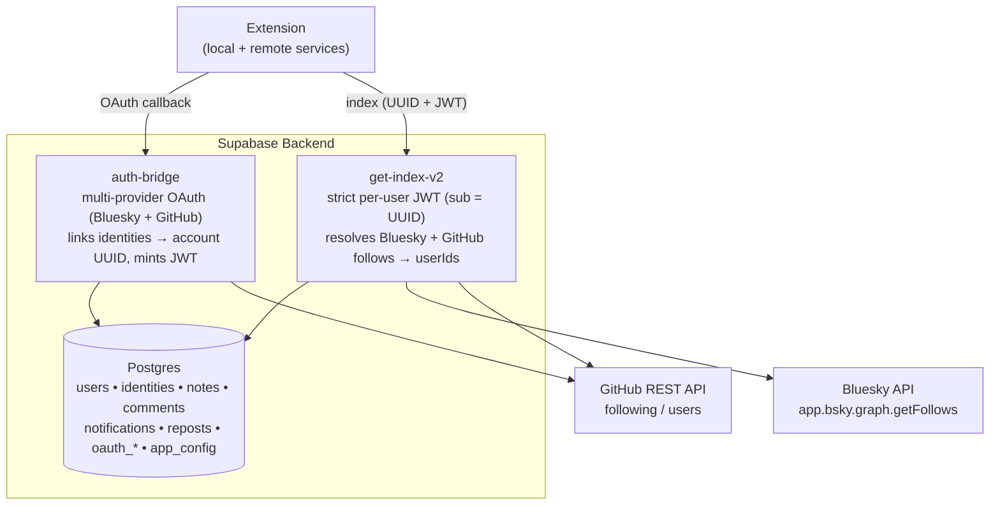

# Supabase Backend Setup

How to set up the Supabase backend (database + Edge Functions) for Mustard's
remote notes / social-graph service. The schema is managed entirely by the
migrations in `supabase/migrations/` — there is no manual SQL to paste.

> For local development (running the whole stack on your machine) see the
> **Local Supabase** section in [README.md](./README.md). This document covers
> setting up a **hosted** project.

## Prerequisites

- A Supabase project ([create one](https://supabase.com))
- Supabase CLI (`brew install supabase/tap/supabase` or `npm install -g supabase`)

## 1. Link the project

```sh
supabase login
supabase link --project-ref YOUR_PROJECT_REF
```

## 2. Apply the database schema (migrations)

The migrations create everything: `users` + `identities` (the UUID account
model), `notes`/`comments`/`notifications`/`reposts`, mentions, the `oauth_*`
auth-state tables, RLS policies, the comment→notification trigger, and
`app_config` (client version guard).

```sh
supabase db push
```

This applies every file in `supabase/migrations/` in order. Locally the same
migrations run automatically on `supabase start` (fresh DB) — use
`supabase migration up` to apply new ones to an existing local DB.

## 3. Deploy Edge Functions

```sh
supabase functions deploy auth-bridge
supabase functions deploy get-index-v2
supabase functions deploy get-index    # legacy, until old clients are retired
```

## 4. Set Edge Function secrets

```sh
# JWT signing secret — Dashboard → Settings → API → JWT Settings → JWT Secret
supabase secrets set JWT_SIGNING_SECRET=your-jwt-secret

# GitHub OAuth (one app per browser, because each OAuth app has a single
# redirect URI). Omit if you don't enable GitHub login.
supabase secrets set \
  GITHUB_CLIENT_ID=... GITHUB_CLIENT_SECRET=... \
  GITHUB_CLIENT_ID_FIREFOX=... GITHUB_CLIENT_SECRET_FIREFOX=...
```

`supabase secrets list` shows SHA-256 digests, not plaintext — that's expected.

## 5. Point the extension at your project

The extension reads its backend URL/key from build-time env vars (no source
edits). Set them in `.env.production` (and `.env.development` for local):

| Variable | Where to find it |
|---|---|
| `VITE_SUPABASE_URL` | Project Settings → API → Project URL |
| `VITE_SUPABASE_ANON_KEY` | Project Settings → API → Project API keys → `anon` `public` |

Then build: `nr build` (Chrome) / `nr build:firefox`.

## 6. Verify

1. Load the built extension and log in with Bluesky or GitHub.
2. Create a local note and publish it.
3. Dashboard → Table Editor → `notes` should show the row, with `author_id`
   set to your Mustard **account UUID** (not a DID).

## Architecture



## Security model

- **Authentication**: custom Supabase JWTs minted by `auth-bridge`; the subject
  is an **opaque account UUID** (`users.id`), never a provider id.
- **Identities**: provider-specific ids (atproto DID, GitHub numeric id) live
  only in the `identities` table, which maps them to the account UUID. One
  account can link multiple providers.
- **Authorization**: Postgres RLS — notes are publicly readable; only the author
  (`auth.jwt()->>'sub' == author_id`, the UUID) can write/delete. `get-index-v2`
  additionally verifies `payload.sub === userId` with `jose`.
- **Follow graph**: fetched from each provider's API at request time (Bluesky
  public API needs no auth; GitHub uses the linked token). Per-provider fetches
  degrade independently, so one dead token never hides the whole index.

## Troubleshooting

**Notes not appearing after publishing** — check the browser console, confirm
`VITE_SUPABASE_URL`/`VITE_SUPABASE_ANON_KEY` match the project, check Functions →
Logs, and verify RLS is enabled.

**JWT authentication failing** — confirm `JWT_SIGNING_SECRET` is set
(`supabase secrets list`), check `browser.storage.local` for a `supabase_jwt`
entry, and read the auth-bridge logs. A legacy DID-subject session forces a
one-time re-login by design (see the `atproto-supabase-auth` skill).

**Follows not loading** — verify `get-index-v2` is deployed and check its logs.
Test Bluesky directly:
`https://public.api.bsky.app/xrpc/app.bsky.graph.getFollows?actor=YOUR_DID`.
