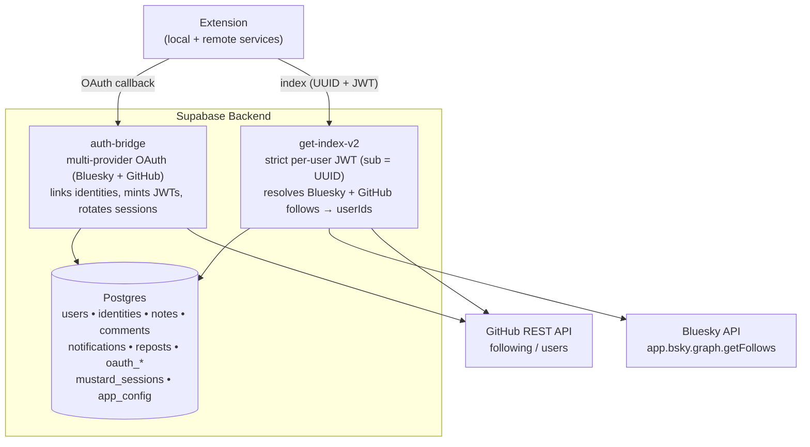

# Supabase Backend Setup

How to set up the Supabase backend (database + Edge Functions) for Mustard's
remote notes / social-graph service. The schema is managed entirely by the
migrations in `supabase/migrations/` — there is no manual SQL to paste.

> For local development (running the whole stack on your machine) see the
> **Local Supabase** section in [README.md](./README.md). This document covers
> setting up a **hosted** project.

## Prerequisites

- A Supabase project ([create one](https://supabase.com))
- Supabase CLI (`brew install supabase/tap/supabase` or `npm install -g supabase`)

## 1. Link the project

```sh
supabase login
supabase link --project-ref YOUR_PROJECT_REF
```

## 2. Apply the database schema (migrations)

The migrations create everything: `users` + `identities` (the UUID account
model), `notes`/`comments`/`notifications`/`reposts`, mentions, the `oauth_*`
upstream-auth tables, revocable `mustard_sessions`, RLS policies, the
comment→notification trigger, and `app_config` (client version guard).

```sh
supabase db push
```

This applies every file in `supabase/migrations/` in order. Locally the same
migrations run automatically on `supabase start` (fresh DB) — use
`supabase migration up` to apply new ones to an existing local DB.

## 3. Deploy Edge Functions

> For a new project, set the secrets in step 4 before testing these functions.
> For an existing production project whose live AT Protocol metadata still
> declares a public client, deploy the non-auth functions normally but do
> **not** deploy `auth-bridge` from this generic sequence. Complete step 4, then
> use the synchronized rollout described below.

```sh
supabase functions deploy auth-bridge
supabase functions deploy get-index-v2
supabase functions deploy link-preview-thumbnail
```

## 4. Set Edge Function secrets

```sh
# JWT signing secret — Dashboard → Settings → API → JWT Settings → JWT Secret
supabase secrets set JWT_SIGNING_SECRET=your-jwt-secret

# AT Protocol confidential client. Keep the value on one line and quote it so
# the shell passes the JSON unchanged. Its public half belongs in the client
# metadata document; never commit this private half.
supabase secrets set ATPROTO_CLIENT_PRIVATE_JWK='{"kty":"EC",...}'

# GitHub OAuth (one app per browser, because each OAuth app has a single
# redirect URI). Omit if you don't enable GitHub login.
supabase secrets set \
  GITHUB_CLIENT_ID=... GITHUB_CLIENT_SECRET=... \
  GITHUB_CLIENT_ID_FIREFOX=... GITHUB_CLIENT_SECRET_FIREFOX=...
```

`supabase secrets list` shows SHA-256 digests, not plaintext — that's expected.

The AT Protocol private key must match the public JWK in the client metadata
served at the `client_id` URL. For an existing deployment that still publishes
the public-client metadata, do **not** deploy the confidential `auth-bridge` and
flip the metadata as separate maintenance changes: the authorization server
checks the live metadata on every login and refresh request. Follow the
[synchronized rollout](./specs/atproto-auth/sketch.md#migration--rollout) and
run `scripts/go-live-atproto-confidential-client.sh` from a clean `main`
checkout after migrations 020–022 and the secret are in place.

## 5. Point the extension at your project

The extension reads its backend URL/key from build-time env vars (no source
edits). Set them in `.env.production` (and `.env.development` for local):

| Variable                 | Where to find it                                            |
| ------------------------ | ----------------------------------------------------------- |
| `VITE_SUPABASE_URL`      | Project Settings → API → Project URL                        |
| `VITE_SUPABASE_ANON_KEY` | Project Settings → API → Project API keys → `anon` `public` |

Then build: `nr build` (Chrome) / `nr build:firefox`.

## 6. Verify

1. Load the built extension and log in with Bluesky or GitHub.
2. Dashboard → Table Editor → `mustard_sessions` should contain a session for
   the new account; an AT Protocol login should also create `oauth_session`.
3. Create a local note and publish it.
4. Dashboard → Table Editor → `notes` should show the row, with `author_id`
   set to your Mustard **account UUID** (not a DID).

## Architecture


```mermaid
flowchart TB
    EXT["Extension<br/>(local + remote services)"]

    subgraph SB["Supabase Backend"]
        AB["auth-bridge<br/>multi-provider OAuth (Bluesky + GitHub)<br/>links identities, mints JWTs, rotates sessions"]
        GI["get-index-v2<br/>strict per-user JWT (sub = UUID)<br/>resolves Bluesky + GitHub follows → userIds"]
        DB[("Postgres<br/>users • identities • notes • comments<br/>notifications • reposts • oauth_*<br/>mustard_sessions • app_config")]
    end

    BSKY["Bluesky API<br/>app.bsky.graph.getFollows"]
    GH["GitHub REST API<br/>following / users"]

    EXT -->|"OAuth callback"| AB
    EXT -->|"index (UUID + JWT)"| GI
    AB --> DB
    GI --> DB
    GI --> BSKY
    GI --> GH
    AB --> GH
```

## Security model

- **Authentication**: custom Supabase JWTs minted by `auth-bridge`; the subject
  is an **opaque account UUID** (`users.id`), never a provider id. JWTs last 24
  hours and carry a `sid` identifying their server-side Mustard session.
- **Mustard sessions**: the client receives an opaque refresh token, while the
  database stores only its hash in the service-role-only `mustard_sessions`
  table. Refresh rotates the token and extends a 90-day sliding expiry. Logout
  deletes the row, and account-management actions reject a JWT whose session is
  no longer live.
- **Upstream sessions**: AT Protocol access/refresh tokens and DPoP keys remain
  server-side in `oauth_session`. They are separate from Mustard's refresh token
  and are refreshed only for operations that need the upstream provider.
- **Legacy upgrade**: v2.9 exchanges a pre-overhaul JWT-only cache for a Mustard
  session on its first authenticated call. v2.8 continues receiving JWT-only
  responses and does not create an unreachable `mustard_sessions` row. Keep
  these compatibility paths until the gates in
  [`specs/atproto-auth/cleanup.md`](./specs/atproto-auth/cleanup.md) are
  satisfied.
- **Identities**: provider-specific ids (atproto DID, GitHub numeric id) live
  only in the `identities` table, which maps them to the account UUID. One
  account can link multiple providers.
- **Authorization**: Postgres RLS — notes are publicly readable; only the author
  (`auth.jwt()->>'sub' == author_id`, the UUID) can write/delete. `get-index-v2`
  additionally verifies `payload.sub === userId` with `jose`.
- **Follow graph**: fetched from each provider's API at request time (Bluesky
  public API needs no auth; GitHub uses the linked token). Per-provider fetches
  degrade independently, so one dead token never hides the whole index.

## Troubleshooting

**Notes not appearing after publishing** — check the browser console, confirm
`VITE_SUPABASE_URL`/`VITE_SUPABASE_ANON_KEY` match the project, check Functions →
Logs, and verify RLS is enabled.

**JWT authentication failing** — confirm `JWT_SIGNING_SECRET` is set
(`supabase secrets list`), check `browser.storage.local` for a `supabase_jwt`
entry, and read the auth-bridge logs. A legacy DID-subject session forces a
one-time re-login by design (see the `atproto-supabase-auth` skill).

**Bluesky reports invalid client authentication** — confirm
`ATPROTO_CLIENT_PRIVATE_JWK` is set, its `kid` and public coordinates match the
live client metadata, and the metadata advertises `private_key_jwt` with ES256.
During the production cutover, inspect the auth-bridge logs before publishing
v2.9.

**Refresh logs the user out** — inspect `mustard_sessions`. A missing or expired
row, or a token older than the one-generation rotation grace, requires login.
Other server errors are treated as transient by the client and retain the local
credentials for a later retry.

**Follows not loading** — verify `get-index-v2` is deployed and check its logs.
Test Bluesky directly:
`https://public.api.bsky.app/xrpc/app.bsky.graph.getFollows?actor=YOUR_DID`.
