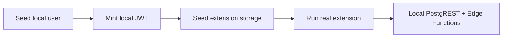

# Testing

## Layers

| Layer             | Command            | What it proves                                                |
| ----------------- | ------------------ | ------------------------------------------------------------- |
| **Type check**    | `nr type-check`    | TypeScript compiles cleanly                                   |
| **Lint**          | `nr lint`          | oxlint rules pass (read-only)                                 |
| **Format**        | `nr format:check`  | oxfmt formatting is consistent                                |
| **Dead code**     | `nr knip`          | No unused exports, files, or deps                             |
| **Unit tests**    | `nr test`          | Pure logic is correct without a browser                       |
| **Chrome build**  | `nr build`         | Extension bundles without errors                              |
| **Firefox build** | `nr build:firefox` | Firefox variant bundles cleanly                               |
| **Firefox lint**  | `nr lint:firefox`  | Mozilla package checks find no blocking errors                |
| **E2E smoke**     | `nr test:e2e`      | Extension loads in real Chromium, popup + content script work |
| **E2E auth**      | `nr test:e2e:auth` | Login-gated flows work against local Supabase                 |

Run everything in one shot (except E2E):

```sh
nr check
```

## Unit tests (Vitest)

Uses WXT's official Vitest integration (`WxtVitest` plugin) with in-memory WebExtension APIs (`fakeBrowser`). No real browser needed.

```sh
nr test        # run once
nr test:watch  # watch mode while developing
```

Test files live under `test/`, mirroring the source path they cover:

- `src/shared/version.ts` — semver comparison + outdated guard
- `src/shared/remote-mutation.ts` — which messages mutate remote state
- `src/background/business/service/MustardNotesServiceLocal.ts` — create / query / update / delete / index persistence

## Extension E2E smoke tests (Playwright + Chromium)

Loads the **built** extension from `dist/chrome` in a persistent Chromium context.
The tests serve their deterministic fixture page through Vite; they never contact
the Mustard backend or an OAuth provider.

```sh
nlx playwright install chromium # once per machine / Playwright version
nr build:e2e                     # build the Chrome extension
nr test:e2e                      # run the smoke suite
```

Tests:

- **`test/e2e/popup.spec.ts`** — popup renders Bluesky/GitHub login tabs, tab switching works
- **`test/e2e/local-note.spec.ts`** — content script injects, captures a synthetic context-menu anchor, saves a local note, and restores it after reload

> **No auth required.** The smoke suite never talks to Supabase, Bluesky, or GitHub. Local note storage uses `browser.storage.local` which works in the real extension context.

## Firefox package checks

`nr lint:firefox` runs Mozilla's `addons-linter` on the Firefox build in
`dist/firefox`. It validates the packaged extension metadata and scans the bundle
for AMO-relevant problems. It complements oxlint, which checks the source code.

The current Vue-generated bundle produces four `UNSAFE_VAR_ASSIGNMENT` warnings
for framework `innerHTML` code. The command fails on errors but reports those
warnings without treating them as release blockers.

### Failure artifacts

Playwright writes `playwright-report/` and `test-results/`; both are generated
and gitignored. On CI failure, `playwright-report` is uploaded for seven days.

Locally, inspect the report with:

```sh
nlx playwright show-report
```

## Authenticated E2E (local Supabase)

The authenticated suite never contacts production, GitHub, or Bluesky:



Start the local stack and Edge Functions in separate terminals:

```sh
supabase start
supabase functions serve --env-file supabase/functions/.env.e2e
```

Then run:

```sh
nr test:e2e:auth
```

The command builds with `.env.e2e`, which points exclusively to
`http://localhost:54321`. Global setup creates a deterministic GitHub-only
Mustard account, identity, and warm follow cache. The Playwright fixture
injects `mustard_session` and `supabase_jwt` into extension storage.

Tests verify:

- the popup recognizes the seeded user without provider login
- publishing writes a remote note through RLS
- reloading fetches that note through `get-index-v2`

Global teardown removes the test user and its notes.
