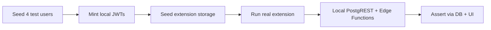
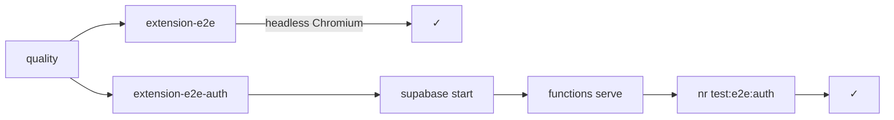

# Testing

## Layers

| Layer             | Command            | What it proves                                                |
| ----------------- | ------------------ | ------------------------------------------------------------- |
| **Type check**    | `nr type-check`    | TypeScript compiles cleanly                                   |
| **Lint**          | `nr lint`          | oxlint rules pass (read-only)                                 |
| **Format**        | `nr format:check`  | oxfmt formatting is consistent                                |
| **Dead code**     | `nr knip`          | No unused exports, files, or deps                             |
| **Unit tests**    | `nr test`          | Pure logic is correct without a browser                       |
| **Chrome build**  | `nr build`         | Extension bundles without errors                              |
| **Firefox build** | `nr build:firefox` | Firefox variant bundles cleanly                               |
| **Firefox lint**  | `nr lint:firefox`  | Mozilla package checks find no blocking errors                |
| **E2E smoke**     | `nr test:e2e`      | Extension loads in real Chromium, popup + content script work |
| **E2E auth**      | `nr test:e2e:auth` | Login-gated flows work against local Supabase                 |

Run everything in one shot (except E2E):

```sh
nr check
```

## Unit tests (Vitest)

Uses WXT's official Vitest integration (`WxtVitest` plugin) with in-memory WebExtension APIs (`fakeBrowser`). No real browser needed.

```sh
nr test        # run once
nr test:watch  # watch mode while developing
```

Test files live under `test/`, mirroring the source path they cover:

| Source file                                                   | Test file                                            | What it covers                                                    |
| ------------------------------------------------------------- | ---------------------------------------------------- | ----------------------------------------------------------------- |
| `src/shared/version.ts`                                       | `test/shared/version.test.ts`                        | Semver comparison, outdated guard                                 |
| `src/shared/remote-mutation.ts`                               | `test/shared/remote-mutation.test.ts`                | Which messages mutate remote state                                |
| `src/shared/mentions.ts`                                      | `test/shared/mentions.test.ts`                       | Sentinel regex, mention extraction, deduplication, shortAccountId |
| `src/background/business/service/MustardNotesServiceLocal.ts` | `test/background/…/MustardNotesServiceLocal.test.ts` | Create / query / update / delete / index persistence              |

## Extension E2E smoke tests (Playwright + Chromium)

Loads the **built** extension from `dist/chrome` in a persistent Chromium context using
`channel: 'chromium'` (headless; no Xvfb required in CI).
The tests serve their deterministic fixture page through Vite; they never contact
the Mustard backend or an OAuth provider.

```sh
nlx playwright install chromium # once per machine / Playwright version
nr build:e2e                     # build the Chrome extension
nr test:e2e                      # run the smoke suite
```

Tests:

- **`test/e2e/popup.spec.ts`** — popup renders Bluesky/GitHub login tabs, tab switching works
- **`test/e2e/local-note.spec.ts`** — content script injects, captures a synthetic context-menu anchor, saves a local note, and restores it after reload

> **No auth required.** The smoke suite never talks to Supabase, Bluesky, or GitHub.

## Firefox package checks

`nr lint:firefox` runs Mozilla's `addons-linter` on the Firefox build in
`dist/firefox`. It validates the packaged extension metadata and scans the bundle
for AMO-relevant problems. It complements oxlint, which checks the source code.

The current Vue-generated bundle produces four `UNSAFE_VAR_ASSIGNMENT` warnings
for framework `innerHTML` code. The command fails on errors but reports those
warnings without treating them as release blockers.

### Failure artifacts

Playwright writes `playwright-report/` and `test-results/`; both are generated
and gitignored. On CI failure, smoke artifacts are uploaded as `playwright-report-smoke`
and auth artifacts as `playwright-report-auth` for seven days.

Locally, inspect the report with:

```sh
nlx playwright show-report
```

## Authenticated E2E (local Supabase)

The authenticated suite never contacts production, GitHub, or Bluesky:



### Prerequisites

Start the local stack and Edge Functions in separate terminals:

```sh
supabase start
supabase functions serve --env-file supabase/functions/.env.e2e
```

Then run:

```sh
nr test:e2e:auth
```

### Test users

| Name       | Role                                             | Handle             |
| ---------- | ------------------------------------------------ | ------------------ |
| `viewer`   | Primary test user; the logged-in extension user  | `mustard-e2e`      |
| `author`   | Publishes notes the viewer should see            | `mustard-author`   |
| `reposter` | Bridges author's notes to the viewer via reposts | `mustard-reposter` |
| `stranger` | Follows nobody — negative control                | `mustard-stranger` |

All four accounts are seeded by `globalSetup` and removed by `globalTeardown`.
Tests that need specific DB state seed and clean it per-test via helpers in
`test/e2e/authenticated/local-supabase.ts`.

### Test files

| File                        | What it covers                                                                                                  |
| --------------------------- | --------------------------------------------------------------------------------------------------------------- |
| `authenticated.spec.ts`     | Popup recognises seeded session; publishes a remote note; reloads and restores it                               |
| `social-visibility.spec.ts` | Follow-graph visibility, repost bridge, unrepost revocation, repostersByNoteId                                  |
| `engagement.spec.ts`        | Comment notification trigger, self-comment exclusion, cascade delete, mention notifications, author popup badge |

### Anon key

The local anon key varies by Supabase CLI version. `.env.e2e` ships a default
value for local development. In CI, the key is extracted from `supabase status`
after `supabase start` and injected as `VITE_SUPABASE_ANON_KEY` — Vite picks up
process-env variables that are prefixed with `VITE_` regardless of `.env` files.

### CI jobs



All three jobs run in parallel (smoke and auth both need `quality`). The auth job
installs the Supabase CLI, starts a full local stack, launches Edge Functions in
the background, and runs the authenticated suite. It always calls `supabase stop`
in the `always()` step to avoid Docker resource leaks.
