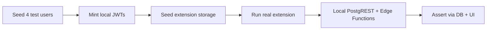
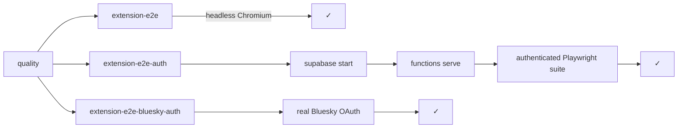

# Testing

## Layers

| Layer                   | Command                    | What it proves                                                |
| ----------------------- | -------------------------- | ------------------------------------------------------------- |
| **Type check**          | `nr type-check`            | TypeScript compiles cleanly                                   |
| **Lint**                | `nr lint`                  | oxlint rules pass (read-only)                                 |
| **Format**              | `nr format:check`          | oxfmt formatting is consistent                                |
| **Dead code**           | `nr knip`                  | No unused exports, files, or deps                             |
| **Unit tests**          | `nr test`                  | Pure logic is correct without a browser                       |
| **Chrome build**        | `nr build`                 | Extension bundles without errors                              |
| **Firefox build**       | `nr build:firefox`         | Firefox variant bundles cleanly                               |
| **Firefox lint**        | `nr lint:firefox`          | Mozilla package checks find no blocking errors                |
| **E2E smoke**           | `nr test:e2e`              | Extension loads in real Chromium, popup + content script work |
| **E2E auth**            | `nr test:e2e:auth`         | Login-gated flows and sessions work against local Supabase    |
| **Live Bluesky OAuth**  | `nr test:e2e:auth:bluesky` | A real provider login creates both session layers             |
| **Every browser suite** | `nr test:e2e:all`          | Builds once, then runs smoke, local auth, and live OAuth      |

Run everything in one shot (except E2E):

```sh
nr check
```

## Unit tests (Vitest)

Uses WXT's official Vitest integration (`WxtVitest` plugin) with in-memory WebExtension APIs (`fakeBrowser`). No real browser needed.

```sh
nr test        # run once
nr test:watch  # watch mode while developing
```

Test files live under `test/`, mirroring the source path they cover:

| Source file                                                   | Test file                                            | What it covers                                                    |
| ------------------------------------------------------------- | ---------------------------------------------------- | ----------------------------------------------------------------- |
| `src/shared/version.ts`                                       | `test/shared/version.test.ts`                        | Semver comparison, outdated guard                                 |
| `src/shared/remote-mutation.ts`                               | `test/shared/remote-mutation.test.ts`                | Which messages mutate remote state                                |
| `src/shared/mentions.ts`                                      | `test/shared/mentions.test.ts`                       | Sentinel regex, mention extraction, deduplication, shortAccountId |
| `src/background/business/service/MustardNotesServiceLocal.ts` | `test/background/…/MustardNotesServiceLocal.test.ts` | Create / query / update / delete / index persistence              |
| `src/background/auth/SupabaseAuth.ts`                         | `test/background/auth/SupabaseAuth.test.ts`          | Cache migration, refresh retries, rotation, logout, concurrency   |
| OAuth client-version compatibility                            | `test/background/auth/OAuthClientVersion.test.ts`    | v2.8 JWT-only and v2.9 refresh-token response handling            |
| auth-bridge persistence helpers                               | `test/auth-bridge/*.test.ts`                         | Query-result and upstream token-persistence failure handling      |
| Local E2E orchestration                                       | `test/scripts/run-local-e2e.test.ts`                 | Suite selection and the single-build execution plan               |

## Extension E2E smoke tests (Playwright + Chromium)

Loads the **built** extension from `dist/chrome` in a persistent Chromium context using
`channel: 'chromium'` (headless; no Xvfb required in CI).
The tests serve their deterministic fixture page through Vite; they never contact
the Mustard backend or an OAuth provider.

```sh
nlx playwright install chromium # once per machine / Playwright version
nr build:e2e                     # build the Chrome extension
nr test:e2e                      # run the smoke suite
```

Tests:

- **`test/e2e/popup.spec.ts`** — popup renders Bluesky/GitHub login tabs, tab switching works
- **`test/e2e/local-note.spec.ts`** — content script injects, captures a synthetic context-menu anchor, saves a local note, and restores it after reload

> **No auth required.** The smoke suite never talks to Supabase, Bluesky, or GitHub.

## Firefox package checks

`nr lint:firefox` runs Mozilla's `addons-linter` on the Firefox build in
`dist/firefox`. It validates the packaged extension metadata and scans the bundle
for AMO-relevant problems. It complements oxlint, which checks the source code.

The Vue-generated bundle can produce `UNSAFE_VAR_ASSIGNMENT` warnings for
framework `innerHTML` code. The command fails on errors but reports those
warnings without treating them as release blockers; avoid documenting an exact
count because generated chunking changes it.

### Failure artifacts

Playwright writes `playwright-report/` and `test-results/`; both are generated
and gitignored. On CI failure, smoke artifacts are uploaded as `playwright-report-smoke`
and auth artifacts as `playwright-report-auth` for seven days.

Locally, inspect the report with:

```sh
nlx playwright show-report
```

## Authenticated E2E (local Supabase)

The authenticated suite never contacts production, GitHub, or Bluesky:


```mermaid
flowchart LR
  Seed[Seed 4 test users] --> JWT[Mint local JWTs]
  JWT --> Storage[Seed extension storage]
  Storage --> Extension[Run real extension]
  Extension --> Local[Local PostgREST + Edge Functions]
  Local --> Assert[Assert via DB + UI]
```

### Run it

Create the ignored local Edge Function environment once. The deterministic
suite only requires its fixed local `JWT_SIGNING_SECRET`; GitHub credentials are
needed only for manual GitHub OAuth testing, and AT Protocol values only for the
live Bluesky suite:

```sh
cp supabase/functions/.env.example supabase/functions/.env
```

Then run the suite directly:

```sh
nr test:e2e:auth
```

> **Always use `nr test:e2e:auth`, not `npx playwright test --config playwright.auth.config.ts` directly.**  
> The command starts or reuses local Supabase, reads its actual URL and anon key,
> starts Edge Functions with `supabase/functions/.env`, builds the extension in
> E2E mode, runs Playwright, and stops the Edge Function process. Running
> Playwright directly skips that setup and can silently test a stale or
> wrong-mode bundle. The Docker-backed Supabase stack stays running for reuse;
> stop it explicitly with `supabase stop` when finished.

### Test users

| Name       | Role                                             | Handle             |
| ---------- | ------------------------------------------------ | ------------------ |
| `viewer`   | Primary test user; the logged-in extension user  | `mustard-e2e`      |
| `author`   | Publishes notes the viewer should see            | `mustard-author`   |
| `reposter` | Bridges author's notes to the viewer via reposts | `mustard-reposter` |
| `stranger` | Follows nobody — negative control                | `mustard-stranger` |

All four accounts are seeded by `globalSetup` and removed by `globalTeardown`.
Tests that need specific DB state seed and clean it per-test via helpers in
`test/e2e/authenticated/local-supabase.ts`.

### Test files

| File                        | What it covers                                                                                    |
| --------------------------- | ------------------------------------------------------------------------------------------------- |
| `authenticated.spec.ts`     | Seeded session, remote publishing/restoration, rate-limit feedback                                |
| `session-refresh.spec.ts`   | v2.8 JWT-only → v2.9 session migration, rotation, grace, revocation, and logout                   |
| `social-visibility.spec.ts` | Follow visibility, repost bridges/revocation, and reposter attribution                            |
| `engagement.spec.ts`        | Comment and mention notifications, joined threads, deletion, deduplication, and popup badges      |
| `hidden-notes.spec.ts`      | Hidden-note gallery, focus-triggered session refresh, and read-only behavior                      |
| `link-preview.spec.ts`      | Verified thumbnail writes, content-addressed deduplication, rendering, and dismissal              |
| `rate-limits.spec.ts`       | Write limits, atomic/concurrent enforcement, service-role exemption, and mention-recipient limits |
| `delete-failure.spec.ts`    | A rejected remote deletion leaves the local note and thread usable                                |

### Anon key

The local anon key varies by Supabase CLI version. `.env.e2e` ships a default
value for local development. In CI, the key is extracted from `supabase status`
after `supabase start` and injected as `VITE_SUPABASE_ANON_KEY` — Vite picks up
process-env variables that are prefixed with `VITE_` regardless of `.env` files.

## Live Bluesky OAuth E2E

This separate smoke test contacts the real AT Protocol authorization server. It
drives login and consent for a dedicated account, then verifies both layers:
the browser receives a Mustard JWT/refresh-token pair, while Supabase stores the
corresponding `mustard_sessions` and upstream `oauth_session` rows. It does not
create or modify records in the account's PDS.

Create the two ignored files from their documented templates:

```sh
cp supabase/functions/.env.example supabase/functions/.env
cp .env.e2e.local.example .env.e2e.local
```

- `supabase/functions/.env` needs `JWT_SIGNING_SECRET`,
  `ATPROTO_CLIENT_PRIVATE_JWK`, and the test metadata URL as
  `ATPROTO_CLIENT_ID`. The private key must match the public JWK in that metadata.
- `.env.e2e.local` needs the dedicated account's `BLUESKY_E2E_HANDLE` and real
  account password. App passwords and accounts with 2FA cannot complete this
  browser OAuth flow.

Run only the live login or every browser suite with one build:

```sh
nr test:e2e:auth:bluesky
nr test:e2e:all
```

The live test allows up to two minutes per test, uses longer assertion timeouts,
and retries once in CI. It deliberately disables traces, screenshots, and video
so a password cannot leak into failure artifacts.

### CI jobs


```mermaid
flowchart LR
  quality --> smoke[extension-e2e]
  quality --> auth[extension-e2e-auth]
  quality --> live[extension-e2e-bluesky-auth]
  smoke --> |headless Chromium| pass1[✓]
  auth --> supabase[supabase start]
  supabase --> fn[functions serve]
  fn --> run[authenticated Playwright suite]
  run --> pass2[✓]
  live --> provider[real Bluesky OAuth]
  provider --> pass3[✓]
```

After `quality` passes, the smoke, deterministic-auth, and live-Bluesky jobs run
in parallel. Both auth jobs start an isolated local Supabase stack and always
stop it afterward. The live job has a 15-minute job timeout and runs only for
`main` pushes and same-repository pull requests because GitHub does not expose
repository secrets to forks. It requires the repository Actions secrets
`BLUESKY_E2E_HANDLE`, `BLUESKY_E2E_PASSWORD`, and
`ATPROTO_CLIENT_PRIVATE_JWK`.
