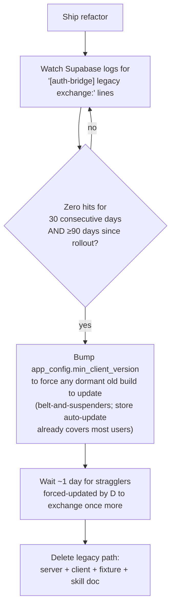

# Post-rollout cleanup

Tracks the debt this refactor _intentionally_ leaves behind for a transition
window, so a future agent/session can act on it directly instead of
re-deriving it from the diff. Nothing here is safe to remove at merge time.

## 1. Legacy JWT→session exchange path

The only item with real removal risk. Kept so existing installs with a
pre-overhaul cached JWT (no `refreshToken`) upgrade silently instead of being
logged out.

**Where it lives:**

- Server (`supabase/functions/auth-bridge/index.ts`):
  `handleLegacyExchange`, the `userId`+`expired_jwt` branch in `handleRefresh`,
  and the current call to `refreshUpstreamAtproto`. Once this migration path is
  gone, reassess the upstream-refresh helpers against the future PDS-write flow;
  routine Mustard session rotation no longer calls them.
- Client (`src/background/auth/SupabaseAuth.ts`): the "no `refreshToken` in
  cache → send legacy `{userId, expired_jwt}` shape" fallback in
  `getSupabaseJwt`.
- Tests: the legacy-shape fixture option in
  `test/e2e/authenticated/authenticated.fixture.ts` and the
  "silently exchanges a legacy jwt-only storage state…" case in
  `session-refresh.spec.ts`.
- Docs: transitional note in the `atproto-supabase-auth` skill.

**Why it's not just time-boxed:** the old JWT was accepted as identity proof
up to 365 days past its own 180-day expiry — a _guaranteed_-safe deadline is
theoretically ~545 days after rollout, which is useless as a practical target.
Use adoption evidence instead.

**Removal gate (all must hold):**

`app_config.min_client_version` is the existing force-update gate (see
`AppStatusService.ts` / `supabase/migrations/008_app_config.sql`) — already
used for similar payload-shape retirements, e.g. `get-index-v2`.

## 2. Pre-upgrade `oauth_session.as_issuer` backfill — no action needed

**Correction of an earlier (wrong) assumption in this doc:** pre-upgrade
atproto `oauth_session` rows (authorized as a public client) are NOT "dead
anyway" once client-metadata.json goes confidential. Verified against
`@atproto/oauth-provider`'s reference AS (which `bsky.social` runs): it checks
each request's auth method against the _live_ client-metadata document, not
the method the session was originally issued with, and explicitly allows a
`none`-issued session to "upgrade" by presenting a client assertion on
refresh. So any account active within the last <2 weeks needs that assertion
on its next refresh, or it breaks — a real regression this doc originally
missed.

This requires **no manual backfill migration** because `refreshAtprotoToken`
resolves it lazily: `resolveAsIssuer()` re-derives the issuer via AS discovery
and persists it to `oauth_session.as_issuer` the first time a pre-upgrade row
is refreshed, then every subsequent refresh is a plain DB read. Noted here
only so nobody spends time writing a one-off bulk-backfill script for it.

If issuer discovery fails, the migration preserves the `oauth_session` row and
continues creating the Mustard session. Discovery and transport failures do not
prove that the refresh token is invalid; a future PDS operation can retry.
Only definitive invalidation such as OAuth `invalid_grant` deletes the row.

## 3. Deploy-time scaffolding (delete once the go-live step has run)

Three files exist purely to make the confidential-client cutover safe and
testable; none of them belong in the repo once `main`'s
`docs/client-metadata.json` is confidential:

| File                                             | Purpose                                                                                                                                                         | Safe to delete once...                                                                                                |
| ------------------------------------------------ | --------------------------------------------------------------------------------------------------------------------------------------------------------------- | --------------------------------------------------------------------------------------------------------------------- |
| `docs/client-metadata-test.json`                 | Throwaway second `client_id` for testing the confidential flow against a real AS without touching production                                                    | The go-live step has shipped and no further pre-prod testing is needed                                                |
| `docs/client-metadata.confidential.json`         | Inert sibling holding the target content for `docs/client-metadata.json`, so cutover doesn't depend on a possibly-squash-merged commit surviving in git history | Immediately after `scripts/go-live-atproto-confidential-client.sh` runs — its job is done the moment it's copied over |
| `scripts/go-live-atproto-confidential-client.sh` | One-shot cutover script (deploy `auth-bridge` + flip metadata back-to-back)                                                                                     | Same as above — it's a single-use migration script, not a repeatable tool                                             |

No removal gate/waiting period needed for these — unlike the legacy-exchange
path, they carry no user-facing compatibility risk. Delete in the same PR
that confirms the go-live step succeeded (or immediately after, once
`auth-bridge` logs show clean confidential-client traffic).

## Explicitly not in scope for this cleanup

- The `did` column kept "for backward-compat" on `oauth_session` — pre-existing
  debt from an earlier refactor, unrelated to this auth overhaul.
- `specs/atproto-auth/sketch.md` and `implementation-plan.md` — keep as
  historical design record after rollout; not cleanup targets themselves.
