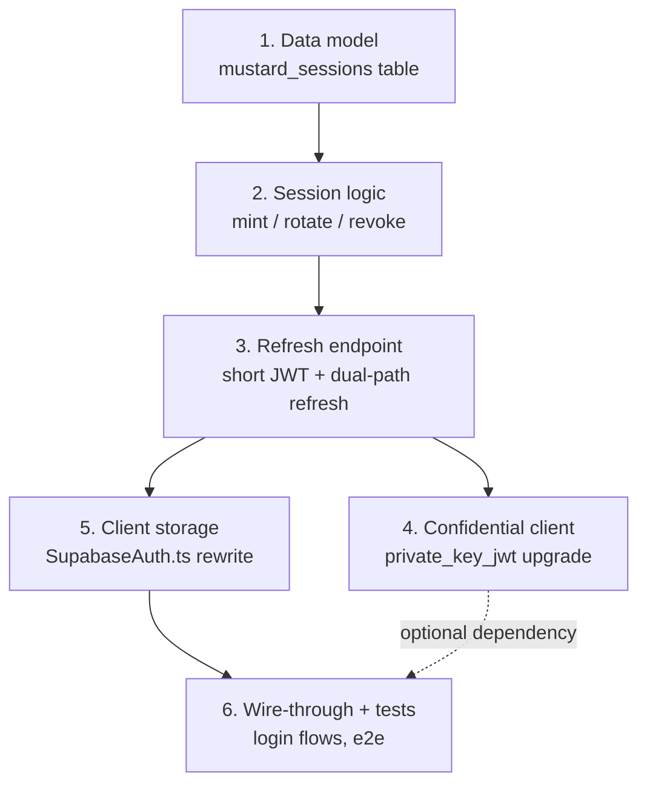

# Implementation Plan (prio-learning mode)

Companion to `sketch.md` (the design). This file tracks the **step-by-step
teach-then-build workflow** we agreed on: each step gets a short explanation
before any code, only that step's scope gets implemented, and we don't move
on until the step is explicitly `approved`.

Status legend: `pending` / `in progress` / `approved`

## Steps

| #   | Step                 | What                                                                                             | Why it matters                                                                             | Status       |
| --- | -------------------- | ------------------------------------------------------------------------------------------------ | ------------------------------------------------------------------------------------------ | ------------ |
| 1   | Data model           | `mustard_sessions` table (hashed refresh tokens, sliding expiry)                                 | Foundation: how we store a revocable session server-side instead of trusting the JWT alone | **approved** |
| 2   | Session logic        | mint/rotate/revoke functions                                                                     | The actual rotation mechanics — why hashing, why a grace window                            | **approved** |
| 3   | Refresh endpoint     | 24h JWT + dual-path `refresh` action (new refresh-token path _and_ one-time legacy-JWT exchange) | How existing users silently upgrade with no re-login                                       | **approved** |
| 4   | Confidential client  | `private_key_jwt` signing + `client-metadata.json` upgrade                                       | Lets Bluesky sessions survive long-term (needed for future PDS writes)                     | **approved** |
| 5   | Client storage       | `SupabaseAuth.ts` rewrite                                                                        | How the extension stores/rotates the pair, thundering-herd handling                        | **approved** |
| 6   | Wire-through + tests | Login/logout call sites, unit + e2e tests                                                        | Ties it together and proves it works                                                       | **approved** |

## Completion note

All six approved steps are implemented. The initial draft scaffolding became
the reviewed production files in migrations 020-022 and
`supabase/functions/auth-bridge/`; the remaining work is the staged production
rollout documented in `sketch.md`, not implementation of these steps.

## Rules for this plan (from the prio-learning skill)

- Explain the concept/approach before writing code, every step.
- Implement only the current step's scope.
- Wait for explicit `approved` before starting the next step.
- Update this file's status column as steps complete.
