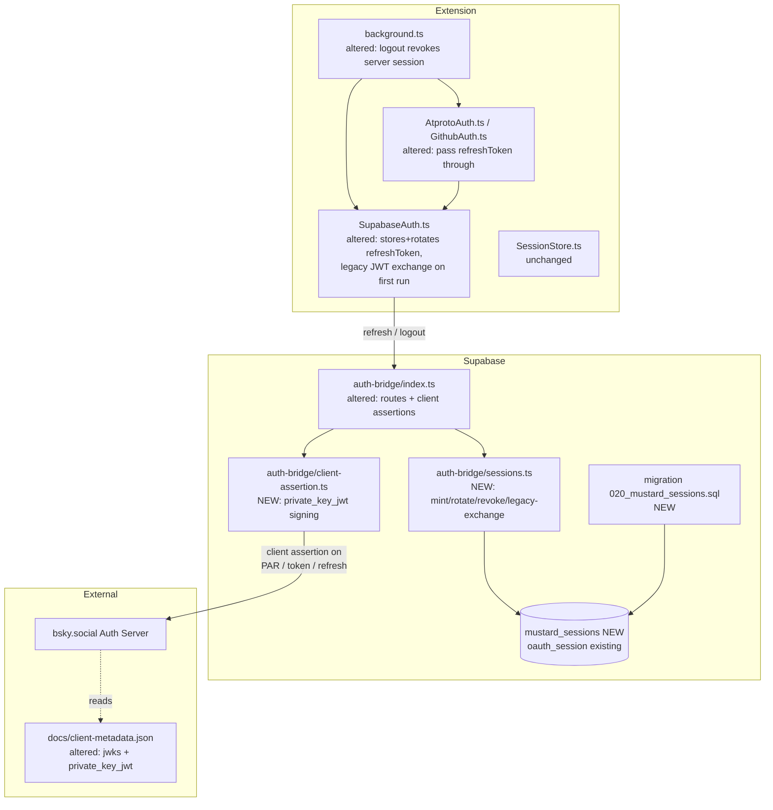
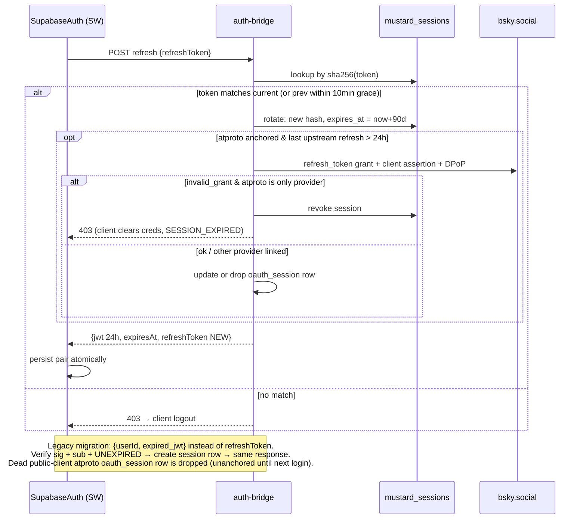
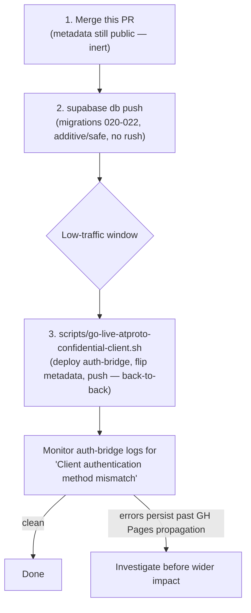

# Auth Overhaul: Short-lived JWTs + Refresh Tokens + Confidential ATProto Client

Status: **sketch approved-in-discussion, not yet implemented**
Owner context: see `.agents/skills/atproto-supabase-auth/SKILL.md` for the current
(pre-overhaul) architecture. This spec describes the target state and migration.

## Why (current problems)

- `auth-bridge` mints one Supabase JWT with a **180-day TTL**
  (`SUPABASE_JWT_TTL_SECONDS` in `supabase/functions/auth-bridge/index.ts`), and
  the `refresh` action accepts that same JWT as identity proof for **365 days
  past expiry**. Access token == refresh credential: long-lived, non-revocable.
- The upstream atproto session stored in `oauth_session` is **never used for any
  API call** (Bluesky follows/profiles come from the public API; scope is only
  `atproto` = identity). It is refreshed only when the Mustard JWT refreshes —
  i.e. at day ~180 — by which time it is long dead.
- Mustard is registered as a **public** OAuth client
  (`token_endpoint_auth_method: "none"` in `docs/client-metadata.json`). Per the
  [atproto OAuth spec](https://atproto.com/specs/oauth), public-client sessions
  are hard-capped at **2 weeks** (refresh does not extend). Confidential clients
  (backend proves itself with a signing key): refresh tokens ~90 days each,
  overall session up to ~2 years with silent rotation
  ([Bluesky OAuth improvements](https://docs.bsky.app/blog/oauth-improvements)).

## Decisions (agreed with Julian, 2026-07-30)

- **Access JWT TTL: 24 h** (constant; trade-off is revocation lag ≤ TTL, chosen
  to keep auth-endpoint load at ~1 call/user/day).
- **Opaque rotating refresh tokens**, stored hashed server-side in a new
  `mustard_sessions` table → revocable, multi-device capable.
- **Sliding idle window: 90 days** (each refresh extends; inactive ≥90 d ⇒
  re-login).
- **Upgrade to confidential atproto client** (`private_key_jwt` + published
  `jwks`). Motivation: planned features will **write records to the user's PDS**,
  which needs a live Bluesky session long-term.
- **Anchor Mustard session to the upstream atproto session**: upstream refreshed
  silently server-side ~daily (piggybacks on the JWT refresh); definitive
  upstream `invalid_grant` (revoked on Bluesky / expired) revokes the Mustard
  session **iff atproto is the account's only provider** (GitHub-linked accounts
  degrade gracefully — GitHub classic tokens never expire).
- **Silent migration, no re-login**: existing valid 180-day JWTs are exchanged
  one-time for a new jwt+refresh-token pair.
- PDS-write features later require a scope upgrade (`atproto` → granular /
  `transition:generic`) ⇒ a one-click re-consent on Bluesky at that point.
  Out of scope here.

## Module graph



Unchanged consumers: `get-index-v2` and `link-preview-thumbnail` keep their
stateless `jose.jwtVerify` — they only ever see the (now shorter-lived) JWT.

## Refresh flow (main sequence)



## DTOs

```typescript
// refresh request (altered)
{ action: 'refresh',
  refreshToken: string }          // added — v2 path
// legacy shape { userId, expired_jwt } kept until min_client_version retires it,
// but now requires an UNEXPIRED jwt (drops the 365d clockTolerance)

// refresh / callback response (altered)
{ jwt: string
  expiresAt: number
  refreshToken: string }          // added: opaque, rotated on every refresh

// logout request (new)
{ action: 'logout', refreshToken: string }   // deletes session row; idempotent 200
```

## Domain types

```typescript
// mustard_sessions row (new, service-role only, RLS: no client access)
{ id: uuid                     // = jwt `sid` claim
  user_id: uuid                // FK users ON DELETE CASCADE
  refresh_token_hash: text     // sha256(base64url(32 random bytes)), unique
  prev_token_hash: text|null   // rotated-out token, honored 10 min (SW-kill race)
  prev_valid_until: timestamptz|null
  created_at, last_refreshed_at: timestamptz
  expires_at: timestamptz }    // sliding: now + 90d on each refresh

// JWT claims (altered)
{ sub: uuid, role: 'authenticated',
  sid: uuid,                   // added — session id; absence marks a legacy token
  iat, exp }                   // exp: now + 24h (was 180 days)

// CachedJwt in src/background/auth/SupabaseAuth.ts (altered)
{ jwt: string, userId: string, expiresAt: number,
  refreshToken?: string }      // added; absent = legacy cache → triggers exchange
```

Constants: `JWT_TTL = 24h`, `REFRESH_TOKEN_TTL = 90d` (sliding),
`ROTATION_GRACE = 10min`, `UPSTREAM_REFRESH_INTERVAL = 24h`.

## Confidential-client upgrade

- One-time: generate ES256 keypair (with `kid`). Private JWK →
  `supabase secrets set ATPROTO_CLIENT_PRIVATE_JWK=...`; public JWK → `jwks` array in
  `docs/client-metadata.json`; set
  `token_endpoint_auth_method: "private_key_jwt"` +
  `token_endpoint_auth_signing_alg: "ES256"`.
- `auth-bridge` sends a client assertion
  (`client_assertion_type=urn:ietf:params:oauth:client-assertion-type:jwt-bearer`,
  JWT with `iss=sub=client_id`, `aud=AS issuer`, `jti`, short `exp`) on **PAR,
  token exchange, and refresh** calls. DPoP handling is unchanged.
- Deploy metadata (GitHub Pages) + auth-bridge together; a brief new-login
  outage during rollout is acceptable.
- **Correction (verified against `@atproto/oauth-provider`'s reference AS,
  which `bsky.social` runs):** the AS does NOT pin a session to its original
  auth method. `compareClientAuth` checks the _current_ request's auth method
  against the **live** client-metadata document on every token/refresh call,
  and explicitly allows a `none`-issued session to "upgrade" by presenting a
  client assertion. So the moment client-metadata.json goes confidential,
  **every** atproto session — old public-client ones included, not just new
  ones — must present a valid assertion on its next refresh, or that refresh
  is rejected. Pre-upgrade sessions are NOT "dead anyway": any user active
  within the last <2 weeks needs their `oauth_session.as_issuer` (absent for
  rows predating migration 021) resolved so `auth-bridge` can build that
  assertion. `refreshAtprotoToken`'s `resolveAsIssuer()` does this lazily (AS
  discovery + persist) on a row's first post-upgrade refresh — no bulk
  backfill needed, and no forced re-login.

## Migration & rollout

`docs/` publishes to GitHub Pages the instant it lands on `main` — no manual
gate, no CI deploy step (checked: `ci.yml` only runs tests/build, nothing
deploys migrations or functions). So **this PR ships
`docs/client-metadata.json` reverted to its current-live public-client
content** — merging it is inert, zero live behavior change. The confidential
version (`private_key_jwt` + `jwks`) is retrievable from git history and only
applied at step 3 below, back-to-back with the function deploy, to keep the
unavoidable mismatch window (see the confidential-client-upgrade correction
above: metadata and code must agree on auth method on _every_ request) as
short as possible.



1. Merge this PR. Nothing live changes yet (see above).
2. `supabase db push` — deploy migrations 020-022 whenever convenient; purely
   additive, old `auth-bridge` ignores the new table/column.
3. At a chosen low-traffic window, run
   `scripts/go-live-atproto-confidential-client.sh` from `main` — deploys
   `auth-bridge` then immediately flips `docs/client-metadata.json` to
   `docs/client-metadata.confidential.json`'s content and pushes, minimizing
   the gap. (Not committed as `git show <branch>:...` from history — a PR
   squash-merge would make that commit unreachable from `main`; the
   confidential content instead lives as a permanent, inert sibling file.)
4. Existing GitHub-linked sessions are unaffected throughout (GitHub never
   touches the confidential-client code path).
5. Existing atproto sessions self-heal on their next refresh via
   `resolveAsIssuer()` — no bulk backfill, no forced re-login, _except_ for
   requests that land inside the brief mismatch window in step 3, which fail
   with a 401 and prompt re-login (acceptable one-time cost, not a recurring
   one).
6. Retire the legacy `refresh` shape later via the existing
   `app_config.min_client_version` guard once adoption evidence supports it
   (see `cleanup.md`).

## Test plan

**test/e2e/authenticated/session-refresh.spec.ts** (new — full lifecycle against
local Supabase; the existing fixture's jwt-only injected state doubles as the
legacy-user scenario)

- silently exchanges a legacy jwt-only storage state for a jwt + refresh token pair and keeps notes loading (migration, no re-login)
- refreshes an expiring jwt using the stored refresh token and persists the rotated pair
- rejects a reused (rotated-out) refresh token after the grace window
- logs the user out with SESSION_EXPIRED when the server-side session row was revoked
- logout deletes the server-side session row so the old refresh token stops working

**test/e2e/authenticated/authenticated.fixture.ts** (altered)

- fixture gains an option to inject the new pair format; default stays legacy shape until the migration window closes

**test/background/auth/SupabaseAuth.test.ts** (new — fast unit coverage)

- serializes concurrent callers so only one refresh request hits auth-bridge
- keeps credentials and returns null on a transient 503 refresh failure
- rejects a legacy did-prefixed cache entry and returns null

**Manual smoke — done**, against a real AS (via the throwaway
`docs/client-metadata-test.json` client_id, see below), all passing:
confidential-client login end-to-end (PAR + assertion + token exchange),
silent refresh rotation, rejected/invalid refresh token → forced re-login
banner, and `resolveAsIssuer()`'s lazy derivation for a pre-upgrade
(`as_issuer = null`) session.

Not covered by manual smoke (lower risk, deferred to post-deploy monitoring):
revoke-on-Bluesky propagation timing, GitHub-linked account surviving
atproto-side death.

## Explicitly out of scope

- Scope upgrade for PDS writes (`transition:generic` / granular scopes) and any
  record-writing feature.
- Deno test harness for edge functions (none exists today).
- "Log out other devices" UI (the sessions table enables it later).
